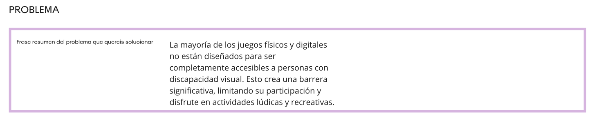
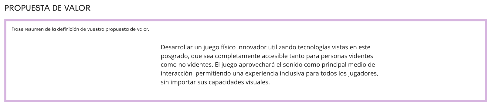
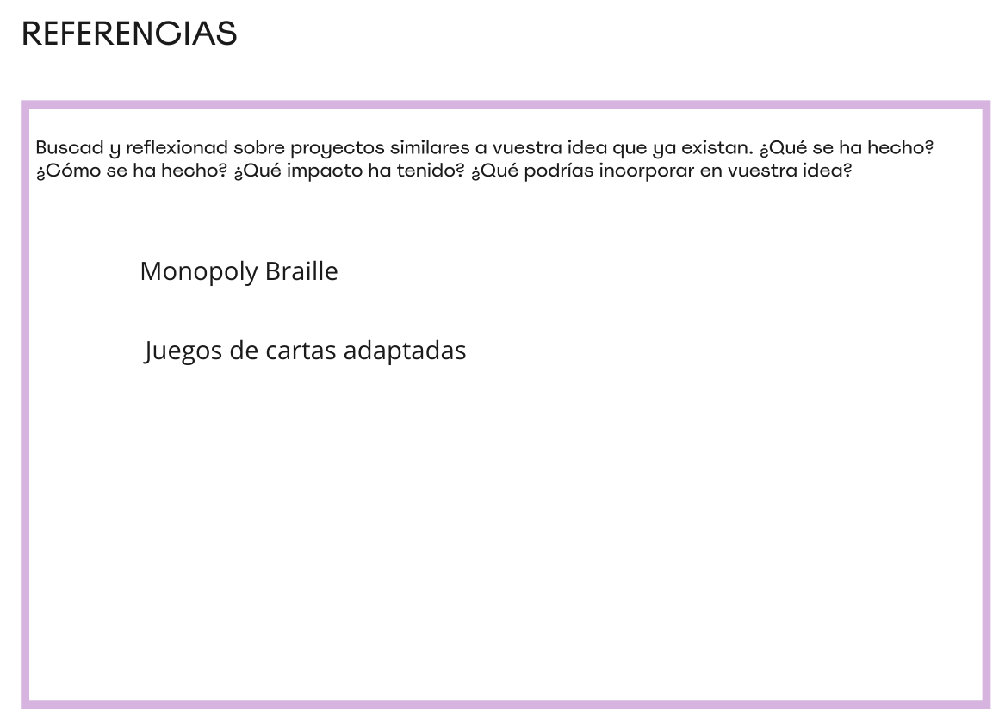
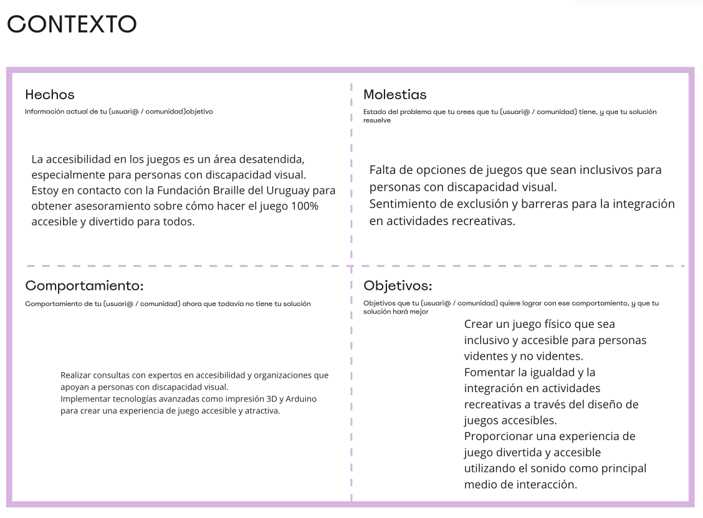

# Actividad MD02

## Introducción al Módulo y Enfoque Inicial

En la primera sesión de nuestro módulo, Joaquín y Santiago, quienes fueron nuestros instructores, nos introdujeron al diseño y prototipado. Durante estas clases, abordamos diferentes enfoques para desarrollar propuestas de valor que realmente resuelvan problemas significativos.

En la segunda clase, profundizamos con Santiago en la creación de la Propuesta de Valor para nuestros proyectos individuales. Este fue el momento donde definí el problema central que quería abordar:

### Problema Identificado

Muchos juegos, tanto físicos como digitales, no están diseñados para ser accesibles a personas con discapacidad visual, lo cual limita su capacidad de participación y disfrute.

### Propuesta de Valor

Mi objetivo es desarrollar un juego físico que sea completamente accesible para personas videntes y no videntes, utilizando el sonido como el principal medio de interacción. Esto permitirá que todos los jugadores, independientemente de sus capacidades visuales, puedan disfrutar de una experiencia de juego inclusiva.

## Investigación y Referencias

Para fortalecer mi propuesta, investigué proyectos existentes que abordan problemas similares. Me centré en las siguientes preguntas para guiar mi investigación:

- ¿Qué se ha hecho anteriormente en este campo?
- ¿Cómo se han implementado estas soluciones?
- ¿Qué impacto han tenido?
- ¿Qué puedo incorporar de estos proyectos en mi idea?

## Colaboración y Asesoramiento

Entendiendo la importancia de la accesibilidad en los juegos, establecí contacto con la Fundación Braille del Uruguay. Ellos me asesoraron sobre cómo hacer el juego 100% accesible y divertido para todos. Esta colaboración fue crucial para asegurar que las necesidades y preferencias de las personas con discapacidad visual estuvieran completamente integradas en el diseño del juego.

## Tecnología y Diseño

Decidí implementar tecnologías avanzadas como impresión 3D y Arduino para crear una experiencia de juego interactiva y accesible. El uso de estas tecnologías me facilitara la creación de componentes táctiles y sonoros del juego.

## Metas y Aspiraciones del Proyecto

Mis objetivos con este proyecto son claros:

- Crear un juego físico inclusivo y accesible para todas las personas.
- Fomentar la igualdad y la integración en actividades recreativas mediante el diseño de juegos accesibles.
- Ofrecer una experiencia de juego divertida y accesible.

## Reflexiones Finales

A lo largo de este proceso, no solo he aprendido sobre el diseño y la tecnología necesarios para hacer accesibles los juegos. Si no que he conocido personas increibles que me insipiran a seguir haciendo crecer mi proyecto.
