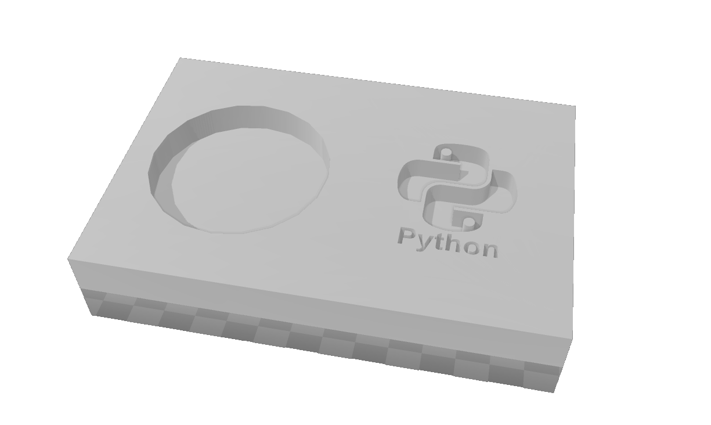
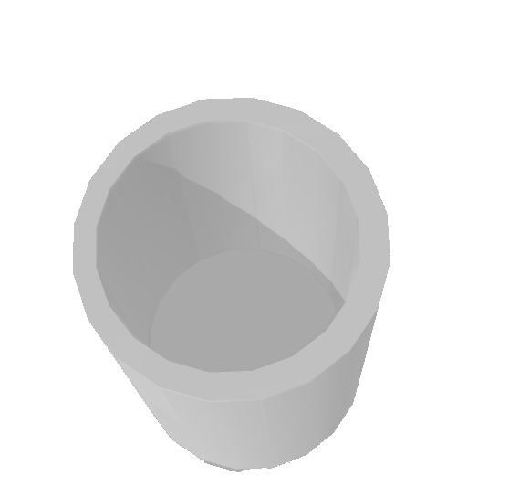
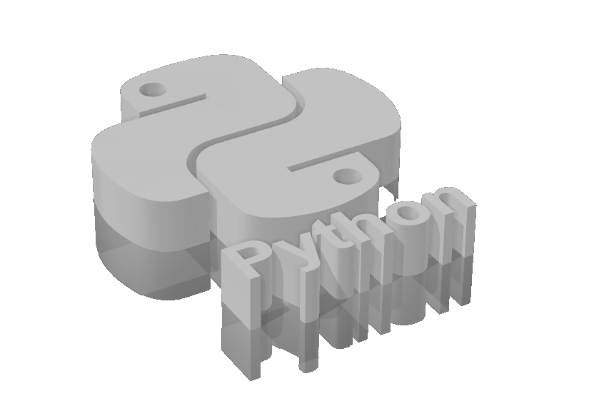
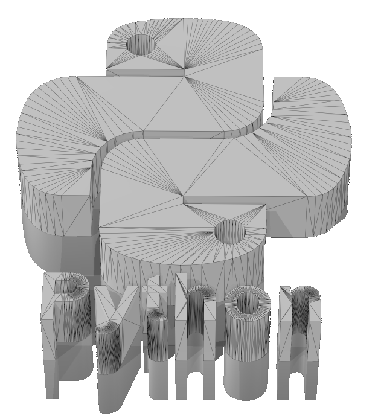
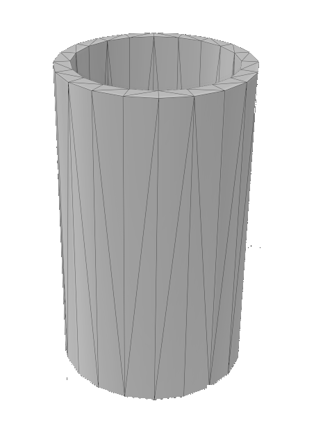
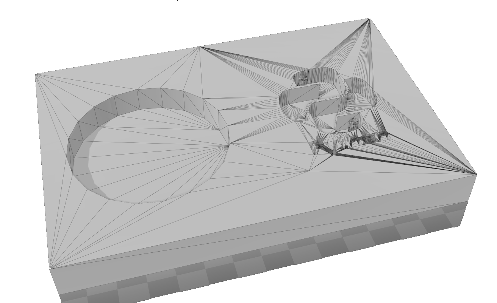

# Actividad MT02

# Proyecto de Piezas Encastrables

Este documento detalla el proceso de diseño y creación de un lapicero modular utilizando diversas herramientas de software, incluyendo Tinkercad, Paint.NET, 3D Builder e Inkscape.

## Herramientas Utilizadas

### Tinkercad

Utilicé [Tinkercad](https://www.tinkercad.com) para el diseño 3D de las piezas. Tinkercad es una aplicación web gratuita para diseño 3D, electrónica y codificación, ideal para educadores, profesionales y principiantes.

### Paint.NET

Para modificar imágenes, utilicé [Paint.NET](https://www.getpaint.net), una herramienta de manipulación de imágenes y fotos.

### Inkscape

Para la vectorización de imágenes, recurrí a [Inkscape](https://inkscape.org), un editor de gráficos vectoriales de código abierto.

## Visualización y Revisión con 3D Builder

Para visualizar y revisar las piezas encastrables en 3D, utilicé [3D Builder](https://apps.microsoft.com/detail/9wzdncrfj3t6?rtc=1&hl=es-es&gl=ES), una herramienta de modelado y impresión 3D proporcionada por Microsoft. Esta aplicación me permitió inspeccionar los modelos 3D y asegurarme de que todos los componentes encajaran correctamente antes de proceder con la impresión 3D.

## Edición y Transformación de la Imagen

Para la creación del logo encastrable, fue necesario editar y transformar una imagen del logo que se integraría en el diseño:

1. **Edición de la Imagen con Paint.NET:**

   - Comencé con una imagen en formato JPG. Utilicé [Paint.NET](https://www.getpaint.net) para eliminar el fondo de la imagen, transformándola así en una imagen PNG transparente.

     
   

2. **Vectorización con Inkscape:**

   - Luego, convertí la imagen PNG en un archivo vectorial utilizando [Inkscape](https://inkscape.org). Esto me permitió escalar el logo sin perder calidad, adecuado para el diseño 3D.

   

   - Finalmente le agregue la palabra Python y deje todo como una sola imagen .svg

   

Este proceso de edición y vectorización fue crucial para asegurar que el logo se pudiera integrar de manera efectiva en las piezas del lapicero, manteniendo la estética y funcionalidad del diseño.

## Diseño de las Piezas

### Lapicero con Piezas Encastrables

El diseño incluye varias partes que se ensamblan entre sí:

1. **Base del Lapicero:**

   - Diseñé la base con dos perforaciones: una para encastrar un cilindro y otra para encastrar el logo de Python.

   

2. **Cilindro Encastrable:**

   - El cilindro diseñado para encastrar en la base.

   

3. **Logo de Python:**

   - El logo de Python, diseñado para encastrar en la base junto al cilindro.

   

## Visualización de las Piezas en Formato STL

Las piezas fueron exportadas en formato STL para su impresión 3D:

- 
- 
- 

## Archivos STL para Descarga

Los archivos STL están disponibles para descargar y permiten la impresión 3D de las piezas diseñadas. Haz clic en los enlaces para descargar los modelos directamente:

- [Descargar STL del Logo Python](../../img/MT02/python.stl)
- [Descargar STL del Cilindro](../../img/MT02/cilindro.stl)
- [Descargar STL de la Base](../../img/MT02/base.stl)
