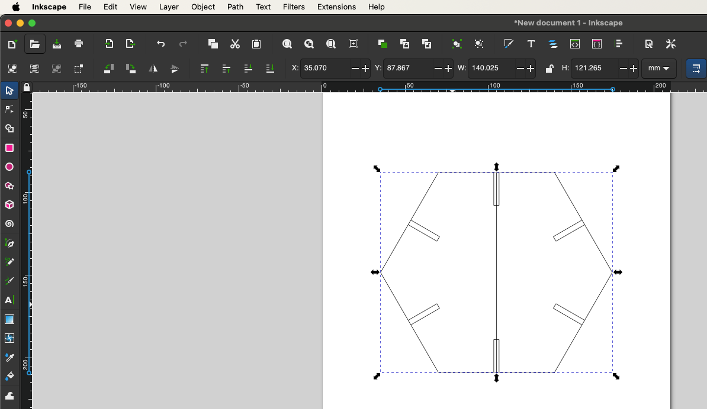
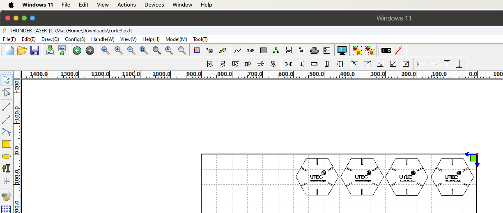
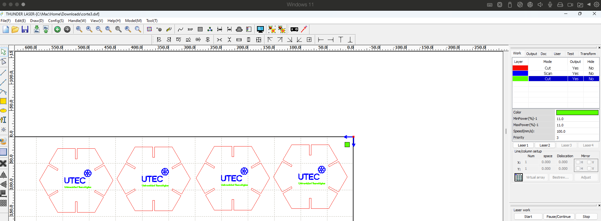
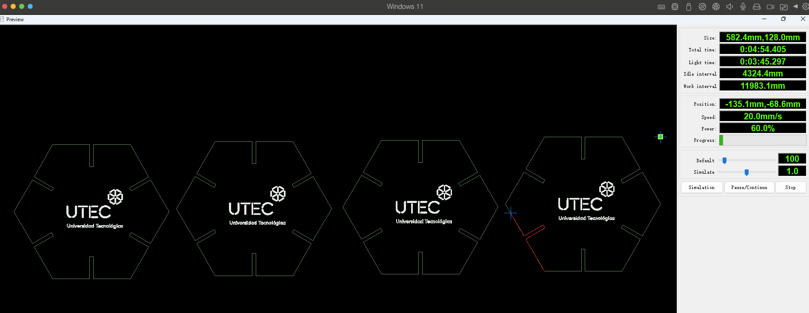
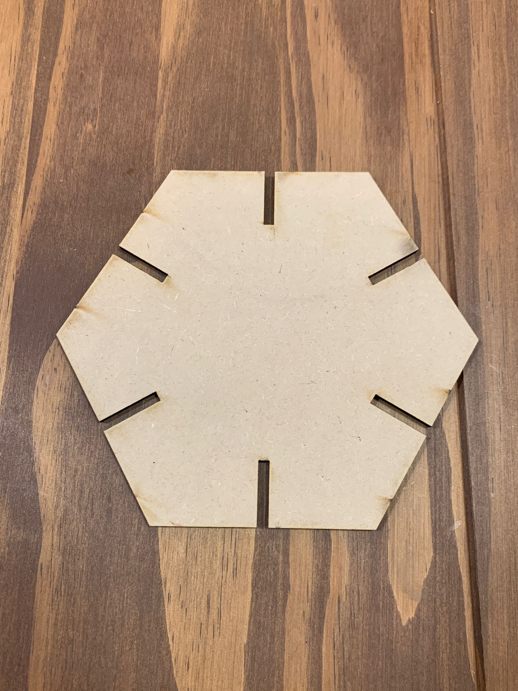
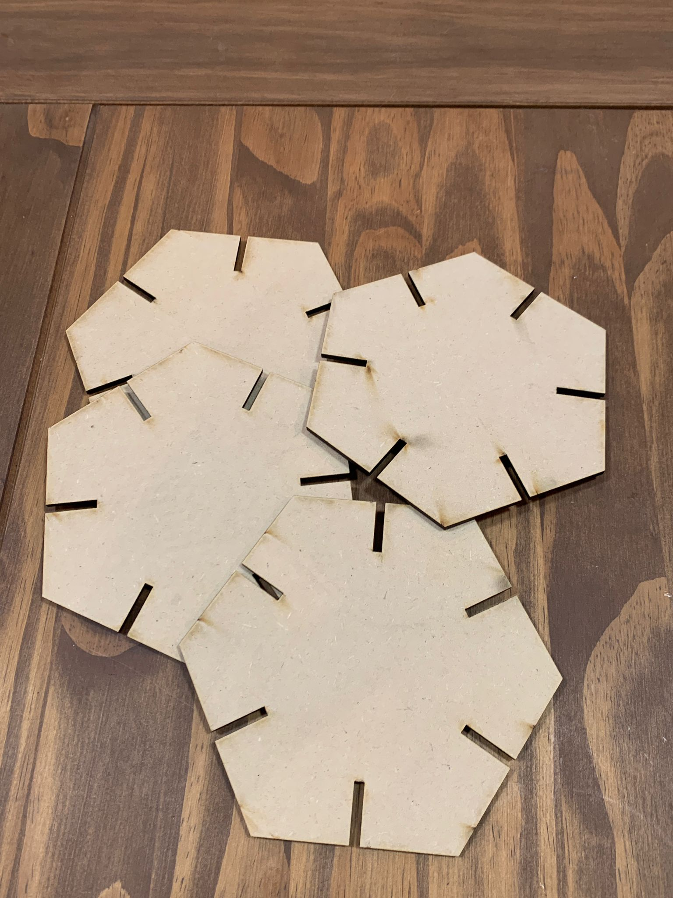
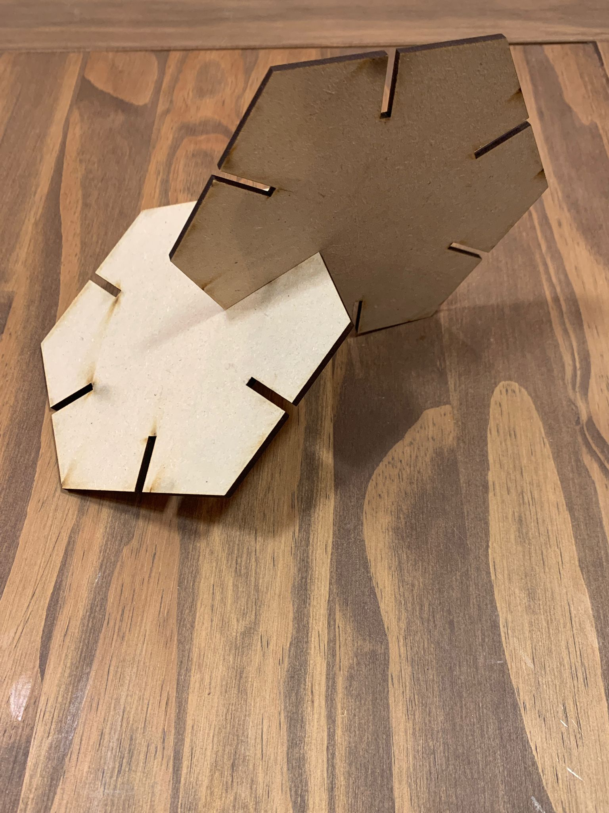
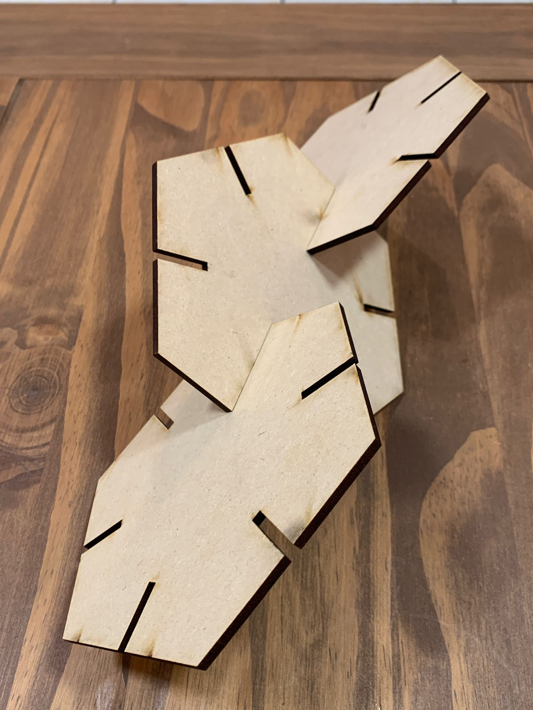
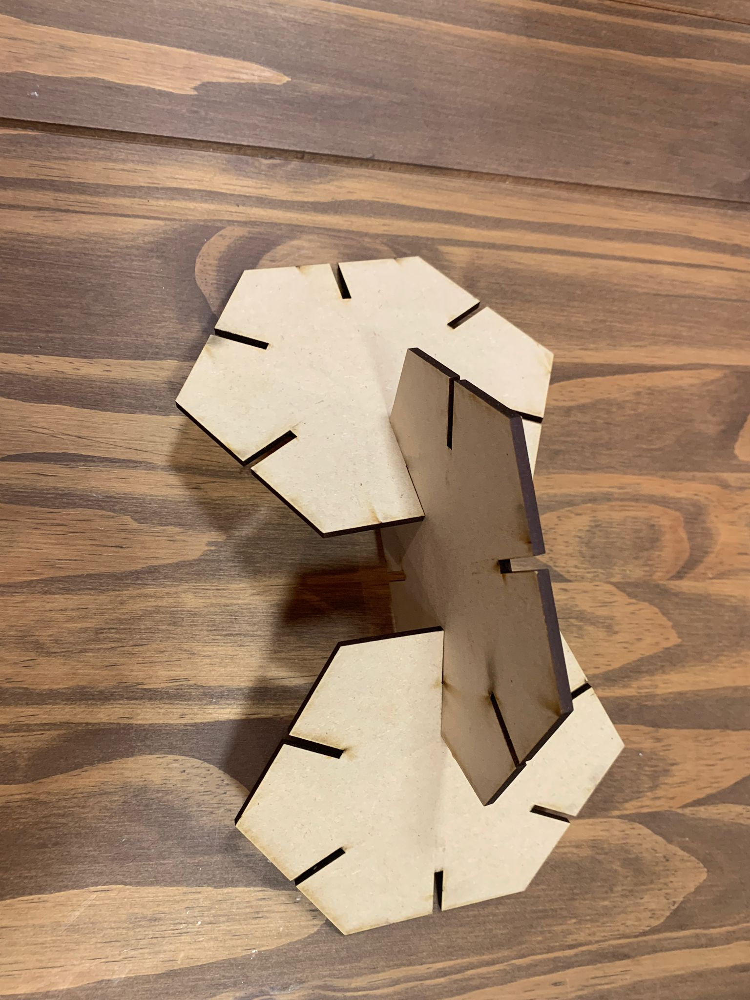

# Actividad MT03

## Herramientas Utilizadas

### Fusion 360

[Fusion 360](https://www.autodesk.com/products/fusion-360/overview) de Autodesk es una plataforma CAD/CAM integral que soporta desde el diseño hasta la simulación y fabricación en una única aplicación basada en la nube, facilitando la colaboración a distancia.

### RDWorks

[RDWorks](https://rdworks.software.informer.com/) es un software de control láser que me permitió ajustar con precisión los parámetros de corte y grabado, optimizando los resultados para diversos materiales.

### Inkscape

[Inkscape](https://inkscape.org) es un poderoso editor de gráficos vectoriales de código abierto, usado para crear y editar imágenes precisas necesarias para el corte láser.

### Tinkercad

Utilicé [Tinkercad](https://www.tinkercad.com) para el diseño inicial de las piezas en 3D, aprovechando su interfaz amigable y capacidades de modelado.

### Paint.NET

Para las modificaciones de imágenes, usé [Paint.NET](https://www.getpaint.net), una herramienta versátil de manipulación de imágenes.

# Corte Láser Controlado por Computadora

Empezamos explorando las capacidades de varias herramientas de software. Fusion 360, proporcionado por Autodesk, fue mi compañero, ayudándome a realizar el diseño. Fusion 360 es particularmente útil debido a su integración de diseño CAD, modelado 3D, y capacidades de simulación, todo en una plataforma basada en la nube que facilitaba el trabajo colaborativo, incluso desde la distancia.

Para los ajustes de diseño y las ediciones de imágenes, recurrí a Paint.NET, una herramienta simple pero poderosa que me permitía manipular imágenes rápidamente. Inkscape también jugó un papel crucial en mi proceso de diseño, especialmente cuando necesitaba crear y editar gráficos vectoriales precisos para el corte láser.

El desafio fue diseñar un objeto modular que consistiera en al menos tres piezas que pudieran ensamblarse sin adhesivos. Este diseño tenía que incorporar grabado raster, marcado y corte sobre vector.

### Configuración y Experimentación

La configuración del láser se convirtió en un juego de precisión y experimentación. Segui el video del docente y utilizamos diferentes colores en el software para indicar distintos niveles de potencia: rojo para cortes profundos a 60% de potencia, azul para grabados superficiales al 11%, y verde para detalles finos con una configuración ligera pero diferente. Ajustar estos parámetros fue esencial para lograr la calidad y la precisión que necesitaba en cada parte del objeto.

### Desafíos Técnicos y Adaptaciones

No todo fue sencillo. La limitación de no poder acceder al laboratorio presencialmente (por motivos personales) me llevó a buscar alternativas. Modifiqué mi impresora Ender 3 para añadirle un láser de 10W, aunque pronto descubrí que solo era adecuado para grabado debido a su baja potencia. Más tarde, tuve la oportunidad de usar una Ender Falcon 2 de 40W que encontré gracias a un amigo. Esta máquina, mucho más potente, era capaz de realizar los cortes necesarios pero tuvimos que modificar la potencia para que haga el corte ya que con el 60% de potencia no le alcanzaba.

Además, enfrenté el reto de hacer funcionar el software de corte, que estaba diseñado principalmente para Windows, Esto me obligó a ser creativo con las soluciones y a aprender más sobre la compatibilidad del software y la adaptabilidad del hardware, virtualizando asi sobre mi SO.

### Imagenes del diseño

  
  
   
   
 

### Reflexiones Finales

Mirando hacia atrás, este módulo no solo mejoró mis habilidades técnicas, sino que también me enseñó lecciones valiosas sobre la importancia de la adaptabilidad y la resolución de problemas. A través de cada desafío y solución, mi comprensión del proceso de diseño y fabricación digital se profundizó significativamente. El trabajo que inicialmente parecía intimidante se convirtió en una serie de problemas solucionables, cada uno de ellos una oportunidad para aprender y crecer.

A pesar de los obstáculos, la experiencia fue increíblemente gratificante. Me dejó con una profunda apreciación de la precisión del corte láser y una curiosidad aún mayor sobre qué más podría lograr con las herramientas y técnicas que había dominado.

Actualizacion: Luego de una charla con el docente me comento que con un laser de 10W como el que tiene adaptado mi Ender3 si hago varias pasadas puedo lograr cortar.

### Archivos para Descargar

A continuación, puedes descargar los diseños y archivos utilizados en este proyecto:

- [Logo DFX](../../img/MT03/logo.dxf)
- [Corte DFX 1](../../img/MT03/corte.dxf)
- [Corte DFX 2](../../img/MT03/corte2.dxf)
- [Corte DFX 3](../../img/MT03/corte3.dxf)
- [Final DFX 3](../../img/MT03/ProyectoCorte.dxf)
- [Final RD](../../img/MT03/corte.rd)
