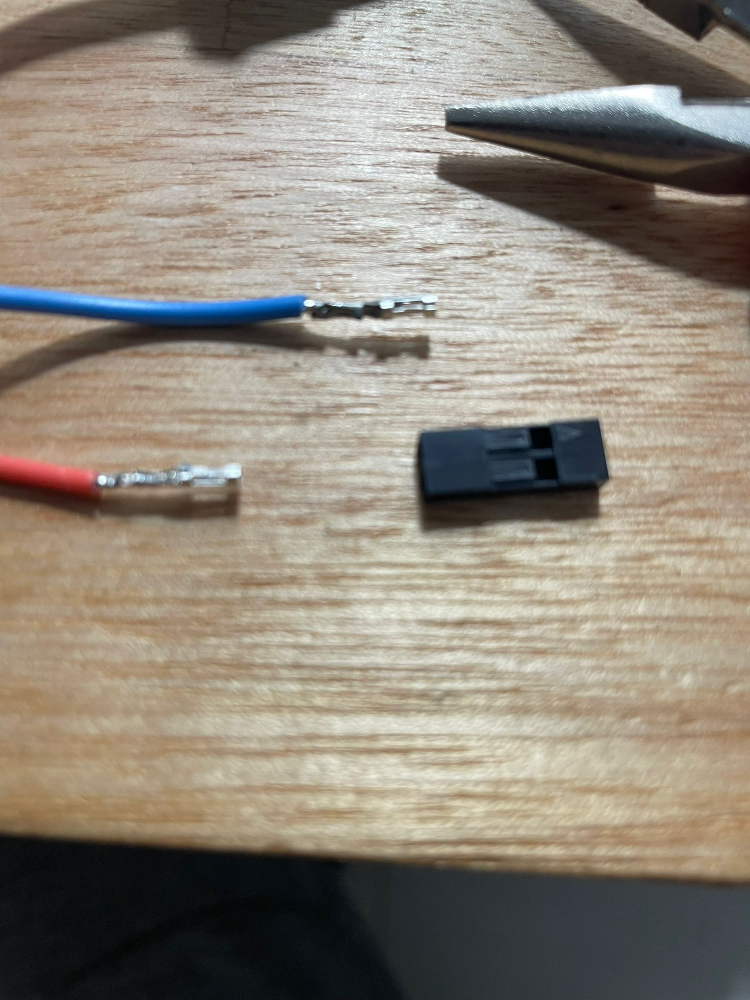

# Actividad MT04

# Actividad MT04: Exploración con Arduino y sus variantes

En esta actividad, exploramos el mundo de Arduino y sus variantes, enfrentando el desafío de utilizar una variedad de componentes y actuadores. He aprovechado esta oportunidad para dar un gran paso inicial hacia mi proyecto final, eligiendo componentes que estarán incluidos en las primeras etapas y avanzando tanto en componentes como en código. En las versiones futuras, continuaré agregando más componentes.

## Herramientas y Componentes Utilizados

### PlatformIO

Utilicé [PlatformIO](https://platformio.org/), una plataforma de desarrollo integrado que admite una amplia gama de placas y kits para IoT. Es especialmente útil para proyectos complejos, facilitando la gestión eficiente del código y las bibliotecas, así como la configuración del entorno de desarrollo.

### Placa de Desarrollo

Para el desarrollo, utilicé un **ESP32** debido a su versatilidad y capacidad para manejar múltiples funciones simultáneamente, ideal para los componentes interactivos de mi proyecto.

### Componentes Electrónicos

- **Botón Pulsador**: Conectado directamente utilizando la resistencia de pull-up integrada del ESP32 en el pin 4, sin necesidad de resistencias externas.
- **Tira de LED WS2811**: Capaz de control individual de LEDs, ideal para efectos visuales complejos.
- **Fuente de Alimentación Variable**: Hasta 12V, para alimentar de manera segura la tira de LEDs.
- **Conectores DuPont y Cables**: Para conexiones rápidas y fiables.
- **Pinza DuPont y Herramienta de Corte de Cables**: Para manipular y preparar los cables.
- **Tester**: Usado para verificar conexiones y asegurar que los valores están dentro de parámetros seguros antes de energizar el sistema.
- **Breakout Board**: Esta elección fue clave para facilitar las conexiones y pruebas durante las fases iniciales del proyecto, proporcionando acceso fácil a todos los pines del ESP32 sin necesidad de soldadura.

## Proceso Paso a Paso

### Configuración Inicial

Coloqué el ESP32 en su **Breakout Board** para facilitar las conexiones iniciales y proporcionar una plataforma estable para los experimentos.

### Conexión de Componentes

Realicé conexiones rápidas para la tira de LEDs, asegurando una instalación fácilmente modificable.





### Integración y Pruebas

Conecté todos los componentes, desde la fuente de alimentación hasta el ESP32 y la tira LED, incluyendo el botón. Usé el tester para validar voltajes y corrientes, asegurando que todo estuviera seguro antes de proceder.


### Desarrollo del Código

El desarrollo del código fue un proceso de prueba y error hasta lograr la funcionalidad deseada.

Codigo:

```
#include <Arduino.h>
#include <Adafruit_NeoPixel.h>

#define PIN 18
#define NUMPIXELS 50
#define BUTTON_PIN 4

Adafruit_NeoPixel strip = Adafruit_NeoPixel(NUMPIXELS, PIN, NEO_GRB + NEO_KHZ800);

void flashAllLEDs(uint32_t color, int times);
void checkButtonPress();

volatile bool buttonPressed = false;
int currentIndex = 0;
int speedDelay = 300;
int testigoIndex = 0;

void setup()
{
  strip.begin();
  strip.show();
  pinMode(BUTTON_PIN, INPUT_PULLUP);
  attachInterrupt(digitalPinToInterrupt(BUTTON_PIN), []()
                  { buttonPressed = true; }, FALLING);
  strip.setPixelColor(testigoIndex, strip.Color(255, 255, 0));
  strip.show();
}

void loop()
{
  checkButtonPress();

  if (currentIndex != testigoIndex)
  {
    strip.setPixelColor(currentIndex, strip.Color(0, 0, 0));
  }
  else
  {
    strip.setPixelColor(testigoIndex, strip.Color(255, 255, 0));
  }

  currentIndex = (currentIndex + 1) % NUMPIXELS;

  if (currentIndex != testigoIndex)
  {
    strip.setPixelColor(currentIndex, strip.Color(0, 0, 255));
  }
  else
  {
    strip.setPixelColor(testigoIndex, strip.Color(0, 0, 255));
  }
  strip.show();
  delay(speedDelay);
}

void checkButtonPress()
{
  if (buttonPressed)
  {
    if (currentIndex == testigoIndex)
    {
      flashAllLEDs(strip.Color(0, 255, 0), 3);
      speedDelay = max(100, speedDelay - 50);
    }
    else
    {
      flashAllLEDs(strip.Color(255, 0, 0), 3);
      speedDelay = 300;
      currentIndex = 0;
    }
    buttonPressed = false;
  }
}

void flashAllLEDs(uint32_t color, int times)
{
  for (int t = 0; t < times; t++)
  {
    for (int i = 0; i < strip.numPixels(); i++)
    {
      strip.setPixelColor(i, color);
    }
    strip.show();
    delay(500);
    for (int i = 0; i < strip.numPixels(); i++)
    {
      strip.setPixelColor(i, 0);
    }
    strip.show();
    delay(500);
  }
  strip.setPixelColor(testigoIndex, strip.Color(255, 255, 0));
  strip.show();
}

```


## Planes Futuros

Este proyecto ha sido un excelente comienzo y planeo expandirlo agregando componentes como:

- **Step-down Converter**: Para un mejor control de la entrada de energía.
- **Batería Recargable**: Para portabilidad y accesibilidad.
- **Parlantes**: Para una interacción sonora mejorada, creando un juego más accesible e inmersivo.

## Resultado Final

El resultado fue un prototipo funcional que demostró la efectividad de la interacción y la integración de todos los componentes.

<video width="600" controls>
  <source src="../../img/MT04/final.mp4" type="video/mp4">
  Tu navegador no soporta la etiqueta de video.
</video>

Este proyecto no solo ha mejorado mis habilidades técnicas sino también mi capacidad para enfrentar desafíos de diseño y ejecución electrónica desde cero.
