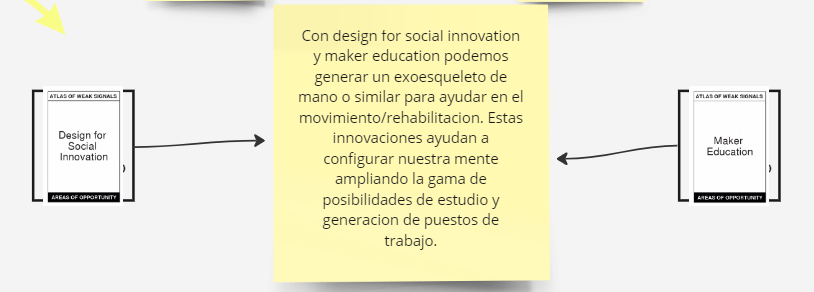

# Actividad MD01

En esta actividad, aprendimos a usar la herramienta **Atlas of Weak Signals (AOWS)**, que sirve para identificar señales tempranas de cambios futuros en diversos campos, facilitando la anticipación y adaptación.

La actividad se desarrolló en Miro, utilizando una serie de tableros para poner en práctica la nueva herramienta. Puedes ver el trabajo completo y los detalles en el siguiente [enlace a Miro](https://miro.com/app/board/uXjVKQDCs3Q=/).

## Etapa 1: Exploración Inicial

Inicialmente, debíamos descubrir dos tarjetas y explicar en una nota lo que entendíamos de cada una de ellas.

- **Instrucciones y Resultado**:

  
  

## Etapa 2: Interconexiones

La segunda etapa implicaba descubrir dos tarjetas más, pero de otro paquete, y evaluar la existencia de interconexiones entre las señales.

- **Instrucciones y Resultado**:

  
  

## Etapa 3: Vinculación con Detonantes

En un nuevo tablero, descubrimos dos tarjetas adicionales denominadas "detonantes", buscando relacionarlas con el hilo que veníamos analizando y vinculando.

- **Instrucciones y Resultado**:

  
  

## Diseño Multi Escalar

Posteriormente, tuvimos un espacio de diseño multi escalar, donde ubicamos post-its para visualizar recursos, referentes y posibilidades, desde lo más cercano a lo más global.

- **Instrucciones y Resultado**:

  
  
  

## Evaluación de Continuidad

Finalmente, evaluamos la continuidad del proyecto, manejando acciones de diseño actuales y alternativas.

- **Resultado**:

  

## Resultado Completo

Este es el resultado completo:

Puedes ver el resultado completo en Miro haciendo zoom out para una vista completa en el [siguiente enlace](https://miro.com/app/board/uXjVKQDCs3Q=/).
