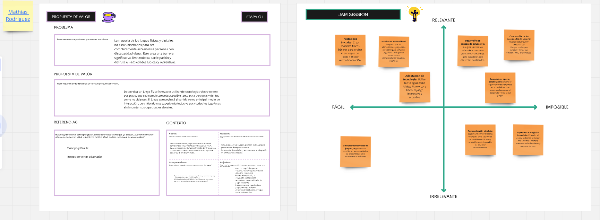
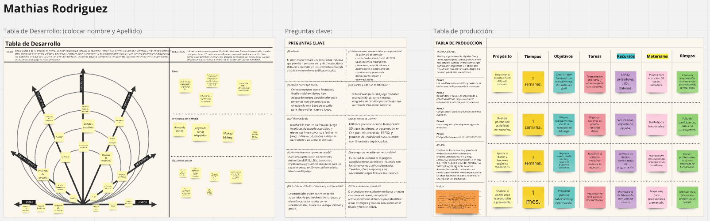
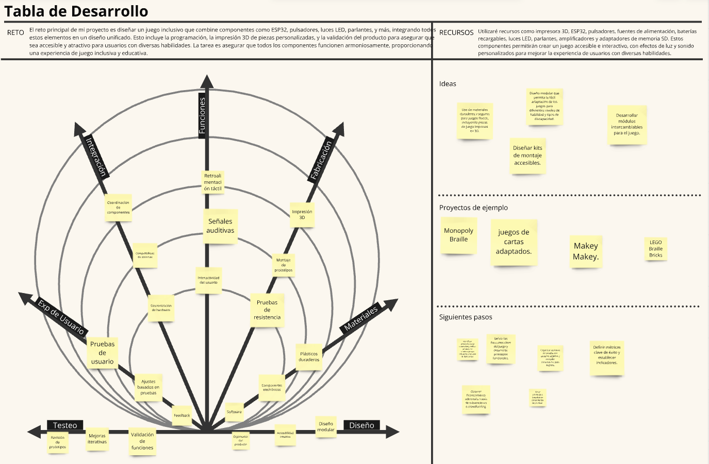
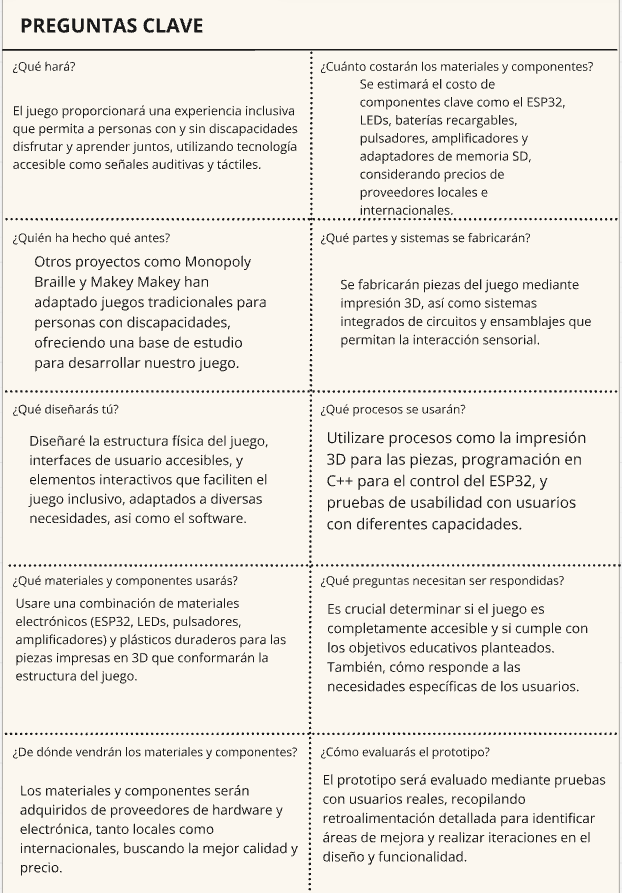
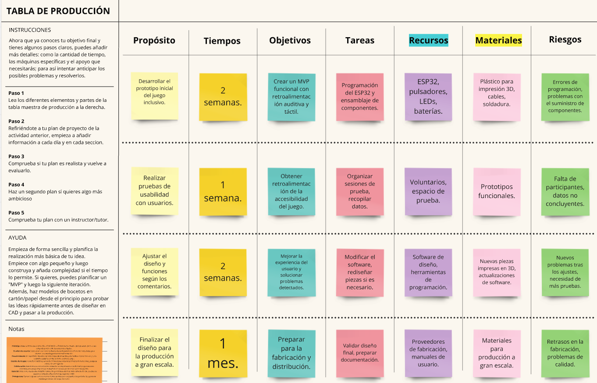
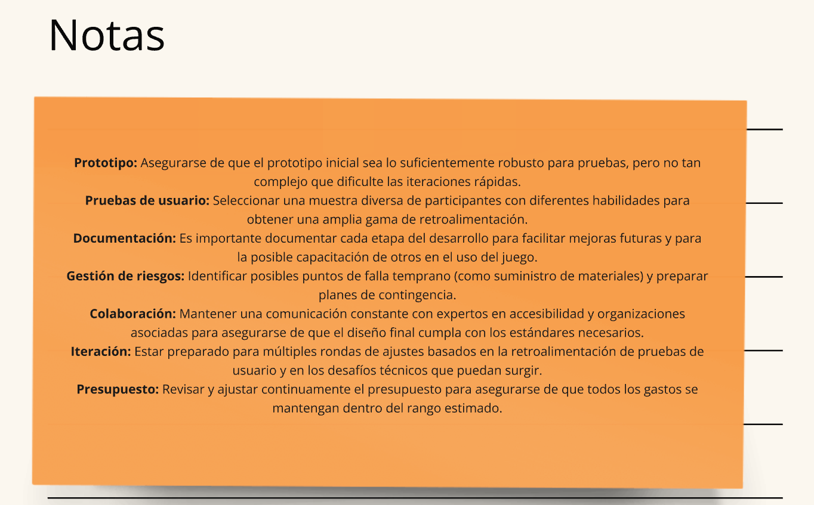

# Actividad MD03

## Actividad MD03 Prototipado y Fabricación

En esta actividad, aprendimos a usar la herramienta **Atlas of Weak Signals (AOWS)**, que sirve para identificar señales tempranas de cambios futuros en diversos campos, facilitando la anticipación y adaptación.

La actividad se desarrolló en Miro, utilizando una serie de tableros para poner en práctica la nueva herramienta. Puedes ver el trabajo completo y los detalles en el siguiente [enlace a Miro](https://miro.com/app/board/uXjVKlm1tIk=/).

Tomamos como base todo lo aprendido hasta el momento en el posgrado pero especificamente el tablero utilizado en el [#MD02](../MD02/MD02.md)

## Proceso

En esta actividad, empleamos una combinación de preguntas estratégicas y post-its para desglosar y organizar los componentes fundamentales del proyecto de desarrollo del juego inclusivo. Este método nos permitió abordar el proyecto en etapas manejables, identificar necesidades específicas y evaluar posibles riesgos, facilitando así una planificación más estructurada y eficiente.

## Definición de Preguntas Clave

Iniciamos con un conjunto de preguntas esenciales que exploraron cada faceta del desarrollo del juego, desde la funcionalidad del producto hasta los materiales necesarios y la evaluación del prototipo. Estas preguntas fueron cruciales para centrarnos en los detalles vitales que requieren resolución antes de proceder.

## Uso de Post-its para Visualización

Respondiendo a cada pregunta en post-its, logramos visualizar claramente cada aspecto del proyecto. Esta técnica nos proporcionó una claridad significativa en la planificación, transformando cada respuesta en un elemento visual en nuestro tablero de proyecto. Esto facilitó la identificación de áreas que requerían atención adicional, como costos de materiales, procesos de fabricación y pruebas de usabilidad.

## Organización y Priorización

Los post-its también mejoraron la organización de ideas y tareas, permitiéndonos priorizar acciones y asignar recursos de manera más efectiva. Al visualizar todas las respuestas juntas, fue más sencillo determinar qué pasos abordar primero y cómo distribuir el tiempo y los recursos disponibles.

## Identificación de Recursos y Riesgos

Esta actividad me ayudó a clarificar los recursos necesarios, como el ESP32, pulsadores, LEDs y otros componentes, y a reconocer los riesgos potenciales en cada etapa del proyecto. Anticipar estos problemas nos permitió desarrollar estrategias proactivas para mitigarlos antes de que se convirtieran en obstáculos significativos.

## Facilitación del Proceso de Decisión

El empleo de preguntas dirigidas facilitaron la toma de decisiones al proporcionar una visión clara de los objetivos y necesidades del proyecto. Este enfoque me hizo más consciente de los detalles operativos y estratégicos, asegurando que cada aspecto del proyecto estuviera bien planificado.

## Conclusión

El uso de preguntas ha demostrado ser extremadamente útil para aclarar y estructurar el proceso de desarrollo del juego inclusivo. Este método ha permitido descomponer un proyecto complejo en elementos manejables, mejorando significativamente la planificación y la organización. Visualizar cada paso del proyecto en post-its ha ofrecido una estructura clara para el desarrollo, ayudándonos a identificar rápidamente las prioridades, las necesidades de recursos y los riesgos potenciales, asegurando un enfoque más estratégico y efectivo para avanzar en el proyecto.

## Resultado Completo

Este es el resultado completo:

Puedes ver el resultado completo en Miro haciendo zoom out para una vista completa en el [siguiente enlace](https://miro.com/app/board/uXjVKlm1tIk=/).
