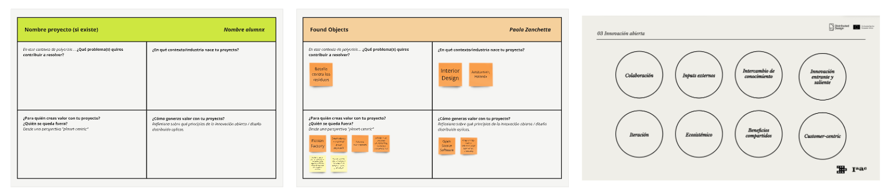
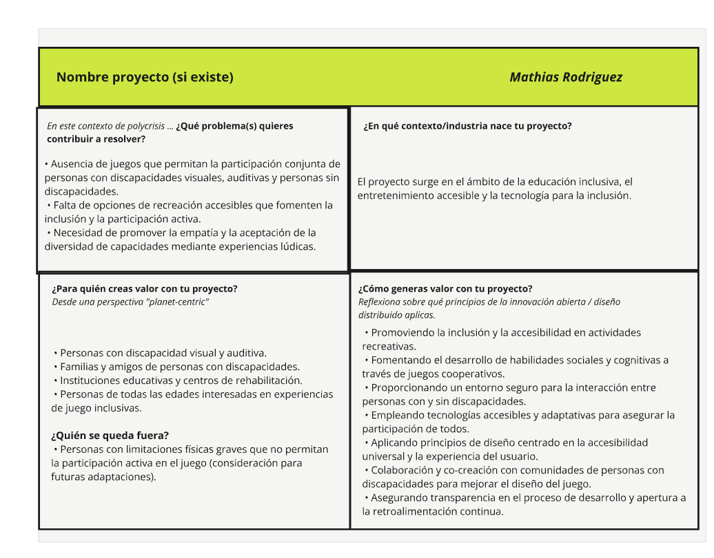
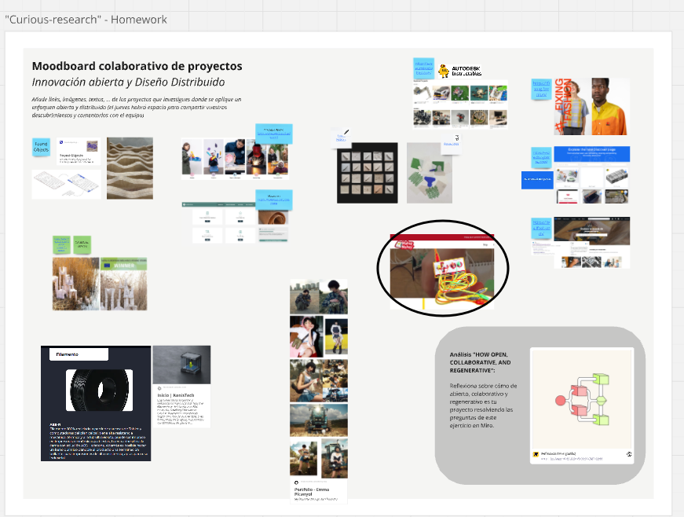
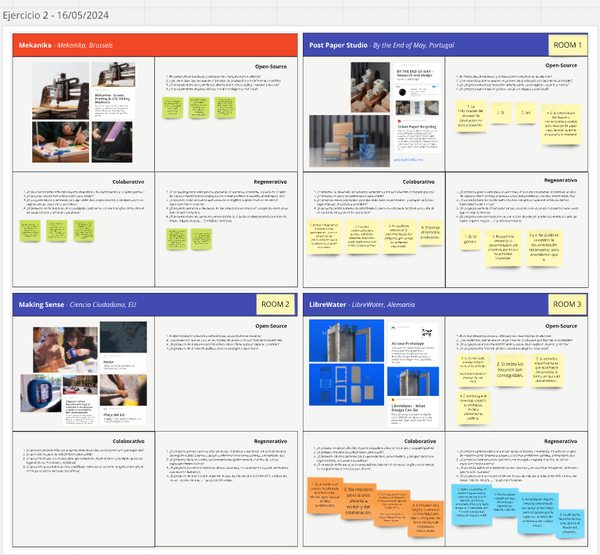
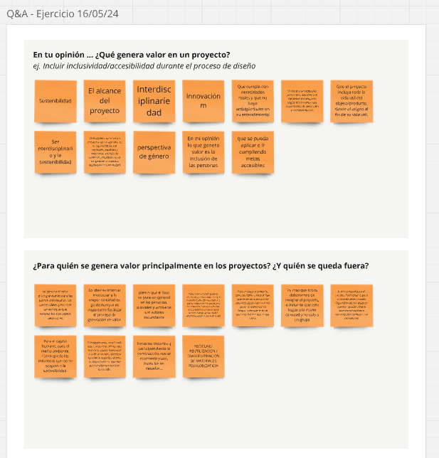
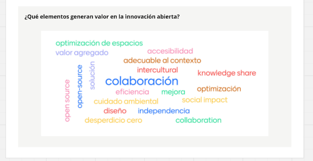

# Actividad MI01

## Uso de Miro para la Colaboración y el Diseño

Durante el curso, adoptamos [Miro](https://miro.com/) como herramienta esencial para la colaboración en línea. Miro nos ha permitido desarrollar y compartir ideas de manera efectiva, independientemente de nuestra ubicación física, aprovechando su versátil pizarra digital para gestionar y organizar recursos visuales y conceptuales.

[Aquí está el enlace a nuestro board de Miro.](https://miro.com/app/board/uXjVKMo0rPU=/)

## Inicio de la actividad

Al principio del módulo, tuvimos una introducción y explicación a cargo de Paola, nuestra docente. Durante la primera clase, discutimos varios temas relacionados con proyectos y metodologías de innovación, especialmente en ámbitos de producción y diseño con un enfoque sostenible. Nos centramos particularmente en los conceptos de código abierto, colaboración, regeneración/sostenibilidad. Se presentaron varios ejemplos de proyectos reales, muchos de los cuales no conocía y me resultaron muy interesantes.

Después de la charla teórica, llevamos a cabo un pequeño ejercicio utilizando la herramienta Miro. La idea era conceptualizar un proyecto, aplicando los conceptos discutidos previamente. Este proyecto podría ser el proyecto final de EFDI, si ya teníamos algo en mente, o simplemente una idea que pudiéramos imaginar aplicando los conceptos teóricos.

Nos proporcionaron una plantilla base para desarrollar el proyecto, dividiéndolo en cuatro tópicos con preguntas guía:

Como ejemplo, teníamos un proyecto realizado por Paola, que servía como referencia para desarrollar nuestro propio proyecto. Siguiendo sus indicaciones, comencé a completar uno de los espacios vacíos centrandome en un proyecto que se fue despertando y puliendo junto con mi pasar por este Posgrado.

Basándome en los conceptos discutidos y las preguntas guía, propuse una iniciativa: desarrollar un juego inclusivo que pueda ser disfrutado por personas con discapacidades visuales, auditivas, y personas sin discapacidades. Este proyecto se diseñaría bajo un modelo de código abierto, permitiendo que la comunidad contribuya y adapte el juego a diferentes necesidades. La idea es crear una experiencia lúdica accesible para todos, utilizando tecnologías interactivas y elementos físicos adaptados.

Al finalizar la clase, recibimos la tarea de investigar proyectos que utilizaran un enfoque abierto y distribuido. Decidí explorar iniciativas relacionadas con la creación de juegos inclusivos y descubrí Makey Makey. Esta plataforma permite a los usuarios crear dispositivos interactivos usando materiales comunes, fomentando la creatividad y la inclusión. Makey Makey se alinea perfectamente con mi idea, ya que proporciona una base abierta para que cualquier persona pueda desarrollar y compartir juegos adaptativos e inclusivos.

Makey Makey aunque no es completamente de código abierto, permite un amplio acceso y personalización de sus funcionalidades. La licencia utilizada por Makey Makey es flexible, permitiendo a los usuarios modificar y adaptar la tecnología para proyectos educativos y creativos. Esto fomenta la innovación y el aprendizaje práctico, aunque ciertas partes del hardware y software permanecen bajo licencia de la compañía JoyLabz, la empresa detrás de Makey Makey.

La plataforma es ampliamente accesible y ha sido diseñada para facilitar el aprendizaje y la exploración, especialmente en el ámbito educativo, aunque con algunas restricciones en cuanto al acceso completo al código fuente. Esto asegura que los usuarios puedan disfrutar de una experiencia segura y controlada, mientras exploran las posibilidades creativas de la tecnología.

[página oficial de Makey Makey](https://makeymakey.com/pages/how-to).

En la segunda clase, comenzamos compartiendo algunas propuestas del Moodboard colaborativo de proyectos. Luego, realizamos un ejercicio grupal en el que se presentaron tres proyectos para comentar y uno de ejemplo. Todos los proyectos compartían características de código abierto, colaboración y regeneración. Nos dividimos en grupos de trabajo en Zoom, cada estudiante eligió el proyecto que más le interesaba. Se plantearon varias preguntas para guiar la discusión en los grupos.

Yo elegí participar en la discusión sobre el proyecto “Making Sense”, asignándome al espacio de trabajo dos:

Esto me permitió discutir y debatir aspectos colaborativos y sostenibles en un entorno grupal.

## Reflexión Final y Aplicaciones Futuras

Este módulo lo considero importante para mi desarrollo académico y profesional, brindándome las herramientas para abordar los desafíos de la sostenibilidad de manera innovadora. Los conocimientos adquiridos me preparan para aplicar estos principios a mi proyecto final, asegurando que mis contribuciones sean tanto técnicamente sólidas como social y ambientalmente responsables.
