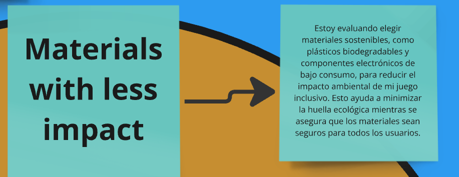
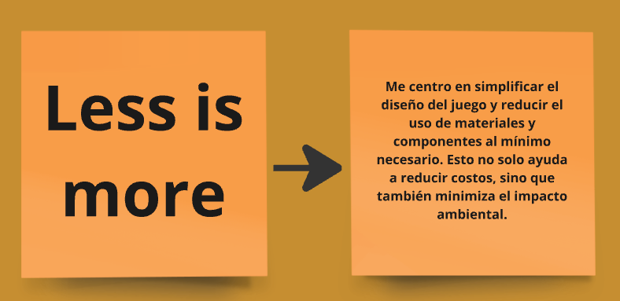
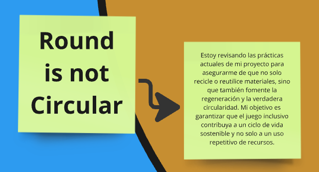

# Actividad MI02

## Desarrollo sostenible y economia circular

Durante el curso, adoptamos [Miro](https://miro.com/) como herramienta esencial para la colaboración en línea. Miro nos ha permitido desarrollar y compartir ideas de manera efectiva, independientemente de nuestra ubicación física, aprovechando su versátil pizarra digital para gestionar y organizar recursos visuales y conceptuales.

[Aquí está el enlace a nuestro board de Miro.](https://miro.com/app/board/uXjVKjpb7U4=/)

## Inicio de la actividad

Trabajamos sobre un board, donde en base a los siguientes criterios teniamos que decir como eramos nosotros.

En mi caso, mi evaluación de sostenibilidad reveló que me encuentro en un punto intermedio. Me identifico con los colores amarillo y naranja, lo cual refleja que he comenzado a adoptar hábitos más responsables, aunque aún tengo camino por recorrer para alcanzar un compromiso más sólido. Esta actividad me llevó a cuestionar qué otras acciones puedo implementar para cuidar el medio ambiente y fortalecer una economía circular.

El amarillo representa que estoy tomando algunas decisiones conscientes, como disminuir mi consumo de carne o interesarme en prácticas ecológicas, aunque todavía no forman parte integral de mi rutina diaria. Por su parte, el naranja indica que ya hice algunos cambios relevantes, pero necesito avanzar más para alcanzar un mayor nivel de compromiso con la sostenibilidad.

Este ejercicio fue muy útil para analizar mi papel en el cuidado ambiental y pensar en cómo puedo ser más activo en contribuir al desarrollo de una economía circular más fuerte.

Luego, intercambiamos materiales y recursos sobre temas fundamentales como sostenibilidad, diseño circular, storytelling y diseño. Esto nos permitió ampliar nuestro conocimiento y aplicarlo a las ideas de nuestros proyectos.

Uno de los ejercicios consistió en identificar y mapear elementos clave relacionados con un proyecto enfocado en sostenibilidad, economía circular y trabajo colaborativo, al mismo tiempo que analizamos los desafíos que surgieron. Esto, a mi entender, nos ayuda a comprender mejor cómo se conectan distintas disciplinas y participantes, y a detectar áreas que requieren más atención o mejoras.

El otro ejercicio, orientado hacia acciones circulares, implicó aplicar lo que habíamos aprendido. Utilizamos como referencia un proyecto de Paola, llamado _Inter Matter + Found Objects_ , junto con un template que sirvió de base para adaptar estos conceptos a nuestra idea de proyecto final para EFDI.

A continuación, comparto las imágenes del proceso de ambos ejercicios.

## Reflexión Final y Aplicaciones Futuras

Este módulo me hizo repensar cómo nuestras decisiones afectan al medio ambiente y la sociedad. Aprendí que la sostenibilidad es una responsabilidad, no una opción, y que la economía circular impulsa soluciones para reducir residuos y optimizar recursos.

Lo más valioso fue aplicar estos principios en mi proyecto y llevarme herramientas para diseñar de forma más consciente, generando un impacto positivo en mi entorno y en las futuras generaciones. Este es solo el inicio hacia un enfoque más sostenible e innovador.
