import ReactPlayer from "react-player";

# Actividad MT05

## Actividad MT05: Trabajo con slicers

Este proyecto representó una oportunidad interesante para profundizar en el mundo de la impresión 3D, utilizando dos herramientas diferentes: IdeaMaker y Bambu Studio. Mi objetivo era no solo familiarizarme con estas plataformas sino también preparar un modelo complejo para la impresión, ajustando cada detalle para asegurar un resultado exitoso.

## Primeros Pasos con IdeaMaker

### Descarga y Preparación del Modelo

El proceso comenzó con la descarga de un archivo `.f3d`, que se encontraba disponible bajo la etiqueta "MODELO 3D" que nos brindo EFDI. A continuación, abrí este archivo en Fusion 360 y lo exporté como un archivo `.STL` en formato binario, preparándolo para su manejo en el software de impresión 3D.

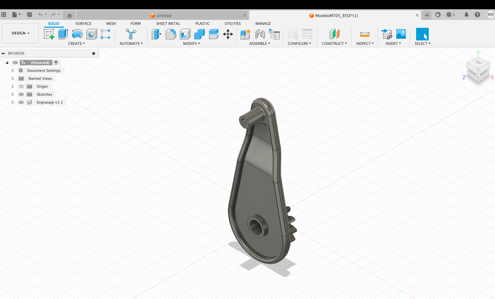
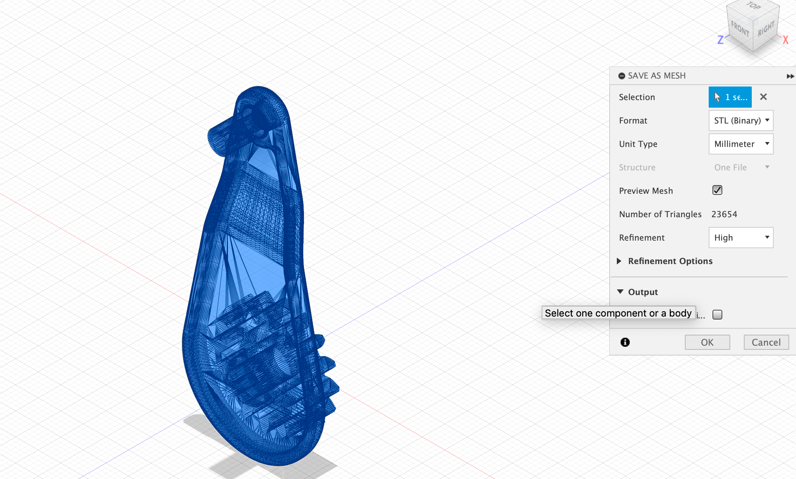

- [Archivo final STL](../../../img/MT05/Engranage_1.stl)

### Configuración en IdeaMaker

Una vez importado el archivo `.STL` en IdeaMaker, comencé a trabajar en la disposición del modelo. Utilicé las herramientas de mover y rotar para posicionar la pieza de la manera más conveniente para su fabricación mediante tecnología FDM. El desafío aquí fue asegurarme de que la orientación y el posicionamiento minimizaran la necesidad de soportes, al tiempo que garantizaban una impresión de calidad.

Escalar el archivo al 150% fue un paso crucial para hacer que los detalles del modelo fueran más manejables y visibles. Posteriormente, generé soportes y seleccioné una base de construcción tipo balsa, configurando los parámetros de impresión para utilizar una altura de capa de 0.2 mm y dos perímetros de pared. Elegí el extrusor izquierdo para llevar a cabo el trabajo, y luego procedí al feteo del modelo, lo que me permitió previsualizar y analizar cada capa del diseño.

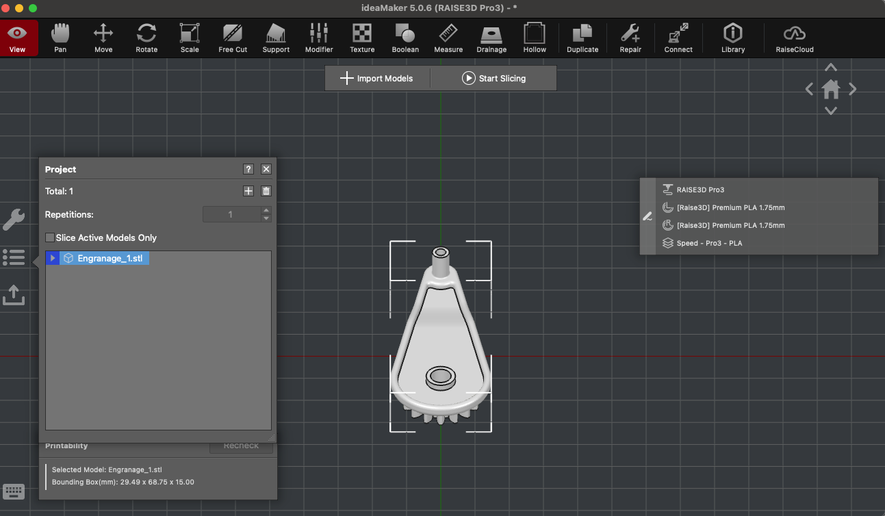
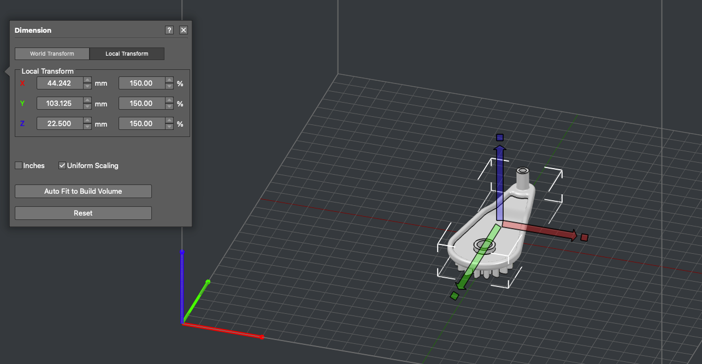
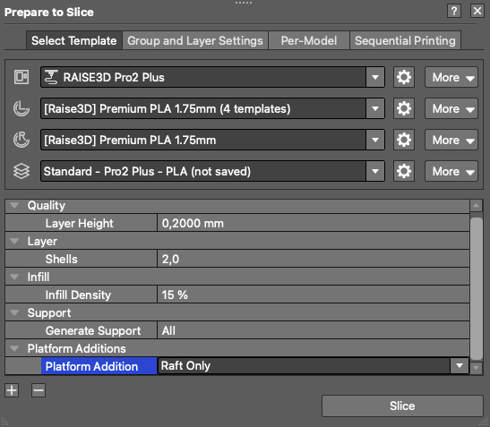
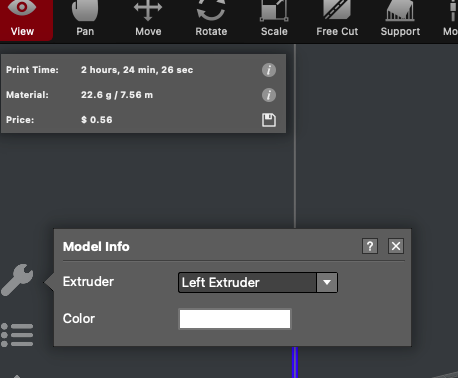
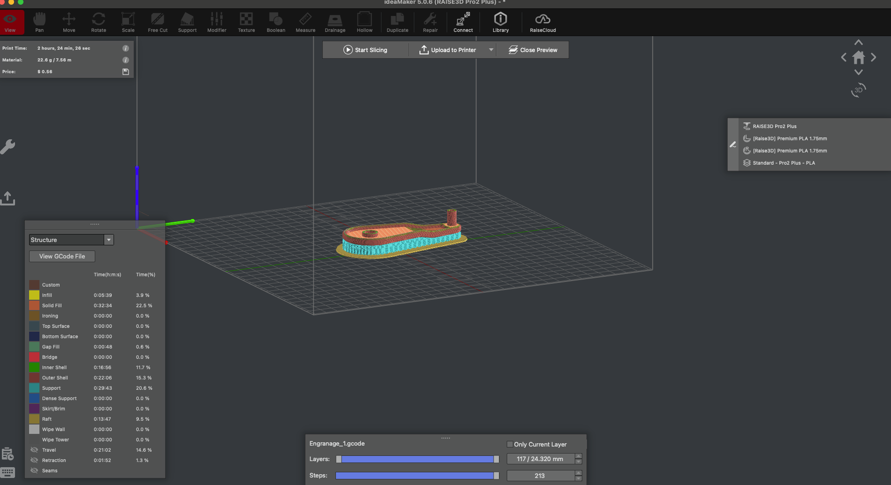

### Resultados y Exportación

Después de verificar y ajustar todo meticulosamente, exporté el archivo final como `Nombre_Apellido.gcode`, listo para la impresión.

- [Archivo final GCODE](../../../img/MT05/Mathias_Rodriguez.gcode)

## Repetición del Proceso con Bambu Studio

Animado por los resultados obtenidos con IdeaMaker, decidí repetir el proceso utilizando Bambu Studio, esta vez con el objetivo de imprimir en una impresora Bambu Lab P1S.

### Ajustes en Bambu Studio

Importé el mismo archivo `.STL` a Bambu Studio y seguí un proceso similar al de IdeaMaker. Ajusté el escalamiento, generé soportes y configuré los parámetros de impresión específicamente optimizados para la Bambu Lab P1S.

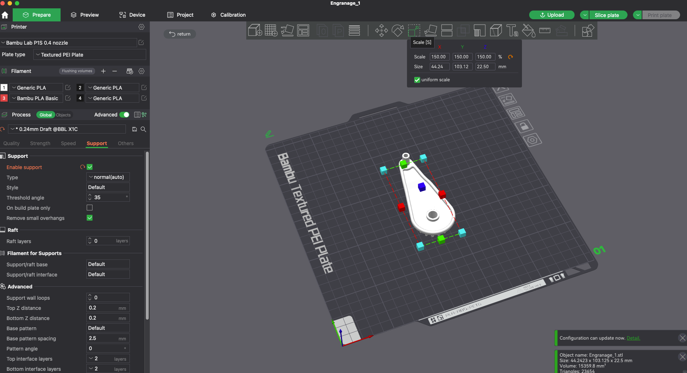
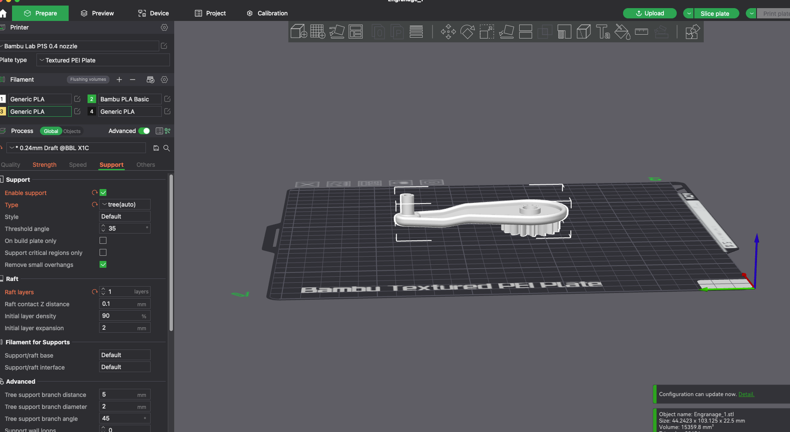
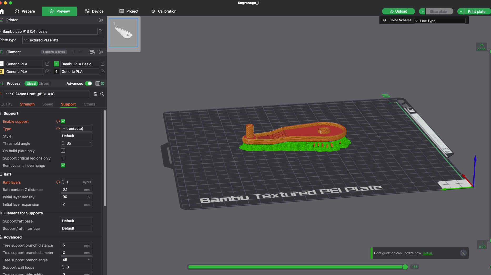

### Impresión Final y Observaciones

La impresión fue un éxito, y el modelo final reflejó la calidad de impresion.

<ReactPlayer controls url="/EDFI/video/MT05/timelapse.mp4" />

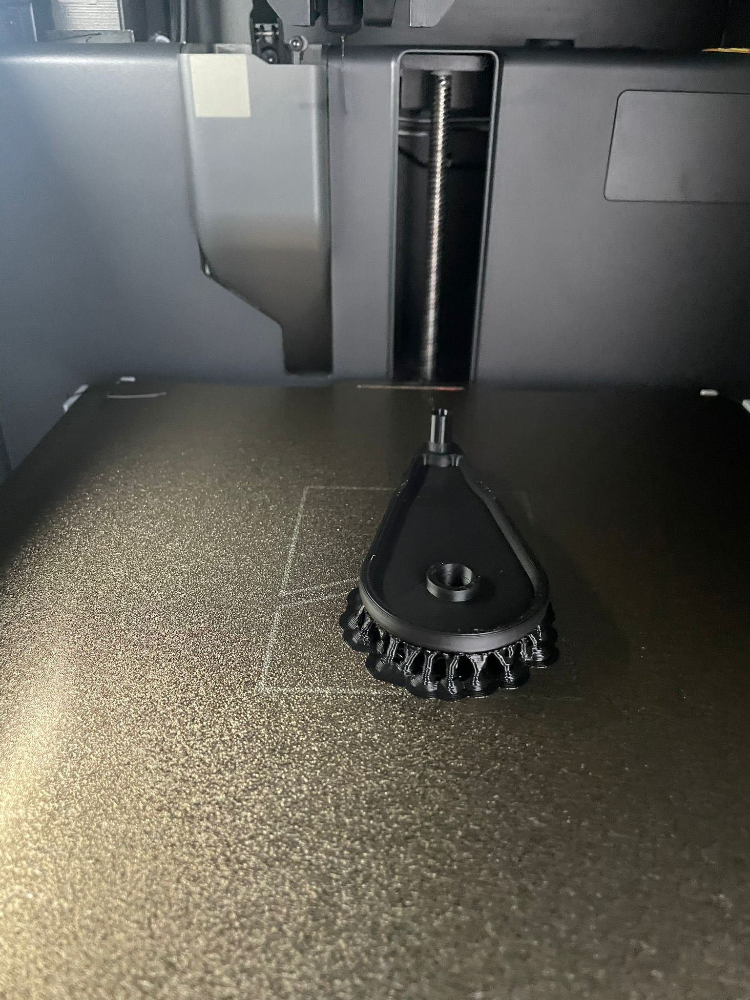
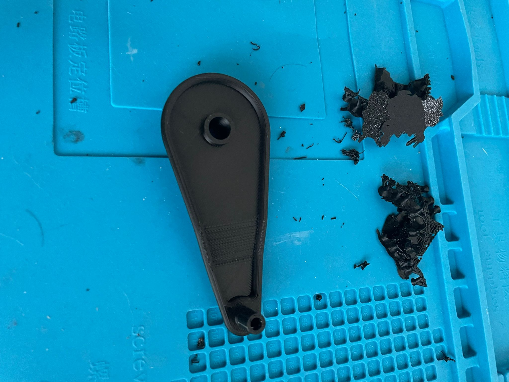
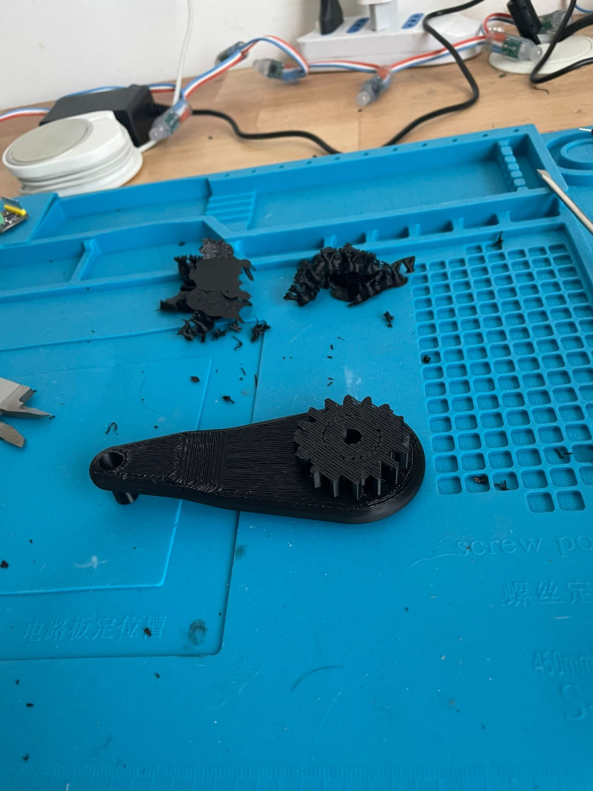
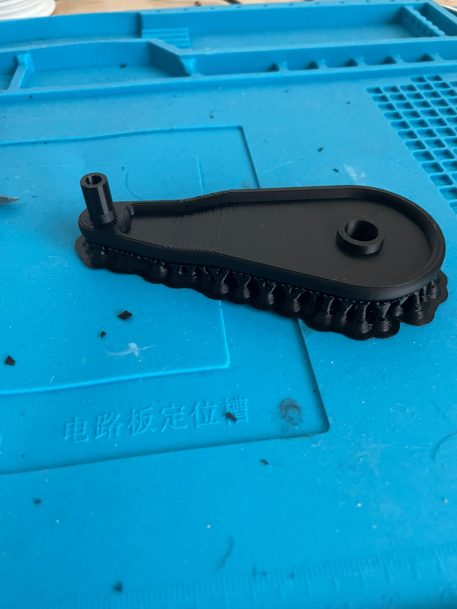
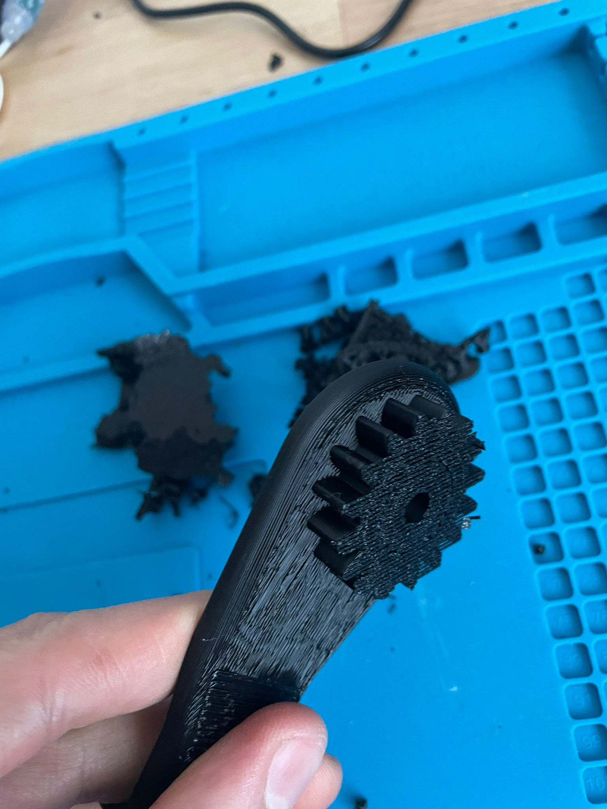

## Conclusión

Este proyecto fue una experiencia educativa muy interesante. Me permitió no solo entender los entresijos de la impresión 3D, sino también aplicar estos conocimientos en la creación de un producto final que era tanto funcional como estéticamente bueno. La habilidad de alternar entre diferentes software de impresión 3D y optimizar cada aspecto del modelo fue crucial, y espero poder aplicar estas habilidades en futuros proyectos.
