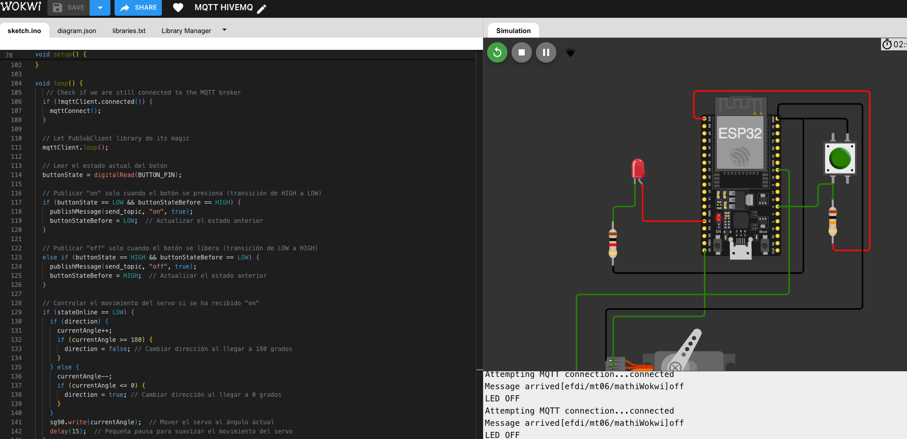

import ReactPlayer from "react-player";

# Actividad MT06

## Actividad MT06: Networking

# Introducción

El módulo **MT06 de Networking** ha resultado ser una experiencia profundamente enriquecedora. No solo se abordaron aspectos técnicos, sino que también exploramos temas cruciales relacionados con la conectividad y la automatización mediante dispositivos IoT. Durante este proceso, quedó claro cómo la combinación de tecnologías de redes y microcontroladores puede conducir a soluciones innovadoras.

En este módulo, trabajamos con el **ESP32**, una placa reconocida por su gran versatilidad y su capacidad de conexión a redes Wi-Fi y Bluetooth. La programación desde **Arduino IDE**, una herramienta ya familiar, hizo que el proceso fuera más ágil y accesible. Sin embargo, uno de los aspectos más novedosos fue el uso de **Wokwi**, una plataforma de simulación que desconocía hasta entonces, pero que permitió diseñar y probar proyectos sin requerir el hardware en mano. Esta herramienta abrió nuevas posibilidades para experimentar sin temor a errores y sin depender de componentes físicos, ofreciendo una perspectiva más flexible y alentadora para el desarrollo de proyectos.

Además, el **protocolo MQTT** fue fundamental en este módulo. Aunque ya tenía conocimiento de su existencia, no había tenido la oportunidad de implementarlo antes. Descubrí su potencial para facilitar la comunicación entre dispositivos en redes IoT, especialmente en aquellos proyectos donde el consumo de recursos es crítico y la estabilidad de la red puede ser un desafío.

En este módulo, el tutor fue **Josep Martí**.

---

Para la tarea estuve trabajando en un proyecto utilizando **PlatformIO** y **Wokwi** para conectar un ESP32 físico con un ESP32 simulado. La idea era implementar una comunicación fluida entre ambos utilizando el protocolo **MQTT**, y finalmente logré que todo funcionara perfectamente gracias a algunos ajustes importantes, incluido el cambio al broker **Mosquitto**, ya que el anterior (HiveMQ) estaba saturado y me generaba problemas de conexión.

## Tecnologías Utilizadas

Para llevar a cabo este proyecto, utilicé varias tecnologías que me permitieron conectar tanto el hardware físico como el simulado de manera eficiente:

1. **PlatformIO**: Utilicé PlatformIO como el entorno de desarrollo para programar el ESP32 físico. Esta herramienta me facilita la integración de bibliotecas y la gestión de dependencias en proyectos de microcontroladores.
2. **Wokwi**: Usé Wokwi como simulador para el ESP32 virtual. Este simulador me permitió trabajar en paralelo con el hardware físico sin depender exclusivamente de él. Pude simular componentes como el servo, el botón, y el LED.
3. **Mosquitto como broker MQTT**: Decidí utilizar **Mosquitto** como el broker MQTT para facilitar la comunicación entre los ESP32. Con Mosquitto, la conexión fue mucho más estable en comparación con HiveMQ, que estaba causando problemas debido a la saturación.

## Componentes Utilizados y Conexiones

En cuanto a los componentes y cómo los conecté:

- **ESP32 Físico**:

  - **Servo SG90** conectado al pin GPIO 19. Este servo responde a los mensajes recibidos vía MQTT.
  - Utilicé **PlatformIO** para escribir el código que controla este ESP32 y se encarga de conectarlo a Mosquitto para suscribirse y publicar mensajes según sea necesario.

- **ESP32 en Wokwi** (simulado):
  - **Botón** conectado al pin GPIO 4.
  - **LED** conectado al pin GPIO 13 para indicar el estado del botón.
  - **Servo SG90** también conectado al pin GPIO 19. La simulación me permitió representar el comportamiento del ESP32 físico y verificar la lógica de funcionamiento.
  - **Wokwi** me permitió probar todo sin necesidad del hardware físico.

## Configuración y Flujo de Comunicación MQTT

Para la comunicación entre los dispositivos, utilicé **Mosquitto** como broker MQTT. A continuación, describo cómo logré que ambos dispositivos se comunicaran de manera sincronizada:

- **Tópicos MQTT**:
  - Cada dispositivo tenía su propio tópico:
    - El Wokwi publicaba en el tópico `"efdi/mt06/mathiWokwi"` para enviar comandos al ESP32 físico.
    - El ESP32 físico publicaba en el tópico `"efdi/mt06/mathiPlaca"` para enviar estados y comandos de vuelta al Wokwi.
  - Ambos dispositivos se suscribían a los tópicos del otro para recibir mensajes y ejecutar acciones.

## Cómo Funcionaba Todo Junto

- Cuando presionaba el **botón** en el ESP32 simulado en Wokwi, se enviaba un mensaje `"on"` al ESP32 físico a través de Mosquitto. Este mensaje hacía que el **servo del ESP32 físico** comenzara a moverse.
- A su vez, el **LED** en el Wokwi se encendía mientras el botón estaba presionado, indicando visualmente que se estaba enviando un comando al ESP32 físico.
- El ESP32 físico, al recibir el mensaje, controlaba el movimiento del servo de manera continua, cambiando la dirección cuando llegaba al ángulo máximo o mínimo.
- Utilicé la misma lógica de comunicación para que el **ESP32 físico** pudiera enviar el estado del servo al Wokwi, manteniendo ambos dispositivos sincronizados.

## Problemas Resueltos

Al inicio tuve algunos problemas con el broker MQTT original que estaba utilizando (HiveMQ). Los dispositivos no se conectaban debido a errores relacionados con la saturación del servidor (`rc=-4` y `rc=5`). Al cambiar a **Mosquitto**, los problemas de conexión se resolvieron y la comunicación entre los dispositivos se volvió más estable.

## Reflexión Final

Gracias al uso de **PlatformIO** y **Wokwi**, pude integrar y probar el hardware y el simulador de manera sencilla. La combinación de ambas herramientas con el broker **Mosquitto** me permitió implementar y validar la comunicación entre los ESP32, logrando que el sistema funcionara sin problemas. Este enfoque fue especialmente útil para simular y probar el comportamiento del hardware antes de desplegarlo completamente en un entorno físico.

Espero que esta experiencia pueda ayudar a otros que estén enfrentando problemas similares con la comunicación entre dispositivos IoT, especialmente en el uso de brokers MQTT públicos que a veces tienden a saturarse.

### Imagenes del proceso.





## Demo

<ReactPlayer controls url="/EDFI/video/MT06/final.mp4" />

## Codigo generado

### PlatformIO

```c
#include <Arduino.h>
#include <ESP32Servo.h>
#include <WiFi.h>
#include <PubSubClient.h>

const int SERVO_PIN = 19;
const int BUTTON_PIN = 4;
const int LED_PIN = 2;

const char *ssid = "Internet";
const char *password = "test123";

WiFiClient wifiClient;
Servo sg90;

const char *mqttBroker = "test.mosquitto.org";
const int mqttPort = 1883;
const char *mqttClientName = "ClienteMathiMT06EFDI1";
const char *mqttUser = "";
const char *mqttPass = "";
const char *name_topic = "efdi/mt06/mathiPlaca";
const char *send_topic = "efdi/mt06/mathiWokwi";

PubSubClient mqttClient(wifiClient);

int buttonState = 0;
int buttonStateBefore = HIGH;
int stateOnline = HIGH;
int currentAngle = 0;
bool direction = true;

void mqttConnect()
{
  mqttClient.setServer(mqttBroker, mqttPort);
  while (!mqttClient.connected())
  {
    Serial.print("Attempting MQTT connection...");
    if (mqttClient.connect(mqttClientName, mqttUser, mqttPass))
    {
      Serial.println("connected");
      mqttClient.subscribe(name_topic);
    }
    else
    {
      Serial.print("failed, rc=");
      Serial.print(mqttClient.state());
      Serial.println(" try again in 5 seconds");
      delay(5000);
    }
  }
}

void callback(char *topic, byte *payload, unsigned int length)
{
  String incomingMessage = "";
  for (int i = 0; i < length; i++)
  {
    incomingMessage += (char)payload[i];
  }
  Serial.println("Message arrived [" + String(topic) + "] " + incomingMessage);
  if (incomingMessage == "on")
  {
    digitalWrite(LED_PIN, HIGH);
    stateOnline = LOW;
    Serial.println("LED ON");
  }
  else if (incomingMessage == "off")
  {
    digitalWrite(LED_PIN, LOW);
    stateOnline = HIGH;
    Serial.println("LED OFF");
  }
}

void publishMessage(const char *topic, String payload, boolean retained)
{
  if (mqttClient.publish(topic, payload.c_str(), retained))
    Serial.println("Message published [" + String(topic) + "]: " + payload);
}

void setup()
{
  Serial.begin(115200);
  pinMode(LED_PIN, OUTPUT);
  pinMode(BUTTON_PIN, INPUT_PULLUP);
  sg90.attach(SERVO_PIN);
  sg90.write(currentAngle);

  // Conectar a WiFi
  WiFi.begin(ssid, password);
  while (WiFi.status() != WL_CONNECTED)
  {
    delay(500);
    Serial.print(".");
  }
  Serial.println("WiFi connected!");

  // Configuración de MQTT
  mqttClient.setCallback(callback);
}

void loop()
{
  if (!mqttClient.connected())
  {
    mqttConnect();
  }
  mqttClient.loop();

  buttonState = digitalRead(BUTTON_PIN);
  if (buttonState == LOW && buttonStateBefore == HIGH)
  {
    publishMessage(send_topic, "on", true);
    buttonStateBefore = LOW;
  }
  else if (buttonState == HIGH && buttonStateBefore == LOW)
  {
    publishMessage(send_topic, "off", true);
    buttonStateBefore = HIGH;
  }

  if (stateOnline == LOW)
  {
    if (direction)
    {
      currentAngle++;
      if (currentAngle >= 180)
        direction = false;
    }
    else
    {
      currentAngle--;
      if (currentAngle <= 0)
        direction = true;
    }
    sg90.write(currentAngle);
    delay(15);
  }
}

```

### Wokwi

```c
#include <ESP32Servo.h>
#include <WiFi.h>
#include <PubSubClient.h>

const int SERVO_PIN = 19;
const int BUTTON_PIN = 4; // Pin donde está conectado el botón
const int LED_PIN = 13;
const char* ssid = "Wokwi-GUEST";
const char* password = "";

WiFiClient wifiClient;
Servo sg90;

const char* mqttBroker = "test.mosquitto.org"; // Broker de Mosquitto
const int mqttPort = 1883; // Puerto sin TLS
const char* mqttClientName = "ClienteMathiMT06EFDI"; //CAMBIAR EL USUARIO
const char* mqttUser = "";
const char* mqttPass = "";
const char *name_topic = "efdi/mt06/mathiWokwi"; // CAMBIAR EL TOPICO
const char *send_topic = "efdi/mt06/mathiPlaca"; // CAMBIAR EL TOPICO
PubSubClient mqttClient(wifiClient);

int buttonStateBefore = HIGH;  // Estado anterior del botón
int buttonState = HIGH;
int stateOnline = HIGH;
int currentAngle = 0;
bool direction = true; // true para avanzar, false para retroceder

void mqttConnect() {
  mqttClient.setServer(mqttBroker, mqttPort);
  while (!mqttClient.connected()) {

    Serial.print("Attempting MQTT connection...");

    if (mqttClient.connect(mqttClientName, mqttUser, mqttPass)) {

      Serial.println("connected");
      mqttClient.publish(send_topic, mqttClientName);

      // Topic(s) subscription
      mqttClient.subscribe(name_topic);

    } else {

      Serial.print("failed, rc=");
      Serial.print(mqttClient.state());
      Serial.println(" try again in 5 seconds");
      delay(5000);

    }
  }
}

void callback(char* topic, byte* payload, unsigned int length) {
  String incomingMessage = "";
  for (int i = 0; i < length; i++) {
    incomingMessage += (char)payload[i];
  }
  Serial.println("Message arrived[" + String(topic) + "]" + incomingMessage);
  if (incomingMessage == "on") {
    digitalWrite(LED_PIN, HIGH);
    stateOnline = LOW;
    Serial.println("LED ON");
  } else if (incomingMessage == "off") {
    digitalWrite(LED_PIN, LOW);
    stateOnline = HIGH;
    Serial.println("LED OFF");
  }
}

//======================================= publising as string
void publishMessage(const char* topic, String payload, boolean retained) {
  if (mqttClient.publish(topic, payload.c_str(), retained)) {
    Serial.println("Message published [" + String(topic) + "]: " + payload);
  }
}

void setup() {
  Serial.begin(115200);
  pinMode(LED_PIN, OUTPUT);
  pinMode(BUTTON_PIN, INPUT_PULLUP);
  sg90.attach(SERVO_PIN);
  sg90.write(currentAngle);

  // Conectar a WiFi
  WiFi.mode(WIFI_STA);
  WiFi.begin(ssid, password);

  // Loop while waiting for connection
  while (WiFi.status() != WL_CONNECTED) {
    delay(500);
    Serial.print(".");
  }

  Serial.println("Connected to WiFi");
  Serial.print("IP address: ");
  Serial.println(WiFi.localIP());

  // MQTT setup
  mqttClient.setServer(mqttBroker, mqttPort);
  mqttClient.setCallback(callback);
}

void loop() {
   // Check if we are still connected to the MQTT broker
  if (!mqttClient.connected()) {
    mqttConnect();
  }

  // Let PubSubClient library do its magic
  mqttClient.loop();

  // Leer el estado actual del botón
  buttonState = digitalRead(BUTTON_PIN);

  // Publicar "on" solo cuando el botón se presiona (transición de HIGH a LOW)
  if (buttonState == LOW && buttonStateBefore == HIGH) {
    publishMessage(send_topic, "on", true);
    buttonStateBefore = LOW;  // Actualizar el estado anterior
  }

  // Publicar "off" solo cuando el botón se libera (transición de LOW a HIGH)
  else if (buttonState == HIGH && buttonStateBefore == LOW) {
    publishMessage(send_topic, "off", true);
    buttonStateBefore = HIGH;  // Actualizar el estado anterior
  }

  // Controlar el movimiento del servo si se ha recibido "on"
  if (stateOnline == LOW) {
    if (direction) {
      currentAngle++;
      if (currentAngle >= 180) {
        direction = false; // Cambiar dirección al llegar a 180 grados
      }
    } else {
      currentAngle--;
      if (currentAngle <= 0) {
        direction = true; // Cambiar dirección al llegar a 0 grados
      }
    }
    sg90.write(currentAngle);  // Mover el servo al ángulo actual
    delay(15);  // Pequeña pausa para suavizar el movimiento del servo
  }
}

```

[Link Wokwi](https://wokwi.com/projects/411866831455936513)

## Reflexión Final

Gracias al uso de PlatformIO y Wokwi, pude integrar y probar el hardware y el simulador de manera sencilla. La combinación de ambas herramientas con el broker Mosquitto me permitió implementar y validar la comunicación entre los ESP32, logrando que el sistema funcionara sin problemas. Este enfoque fue especialmente útil para simular y probar el comportamiento del hardware antes de desplegarlo completamente en un entorno físico.
