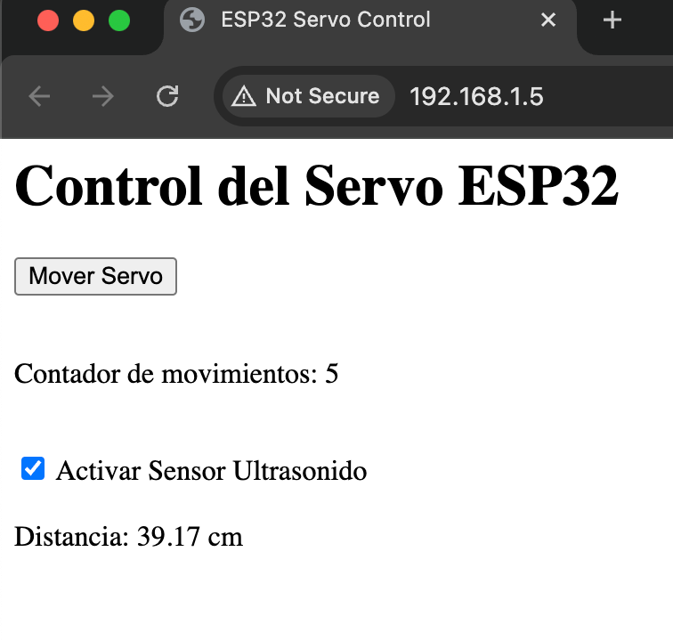
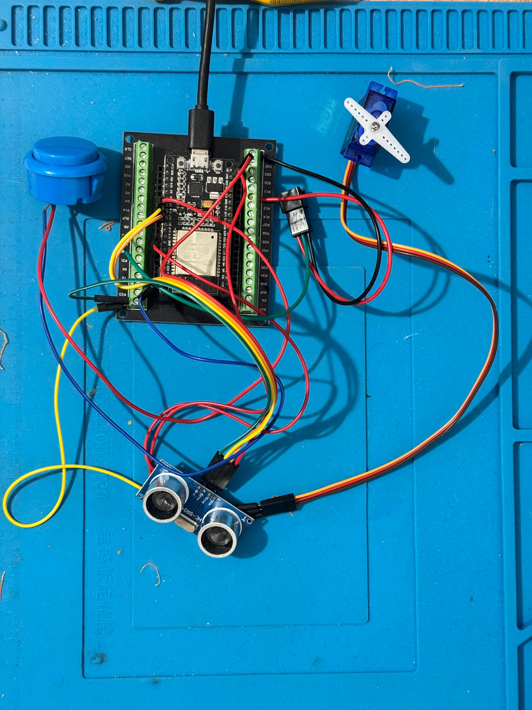

import ReactPlayer from "react-player";

# Actividad MT07

## Actividad MT07: Interfaces digitales y aplicaciones

El módulo **MT07** fue una experiencia completa, donde se combinó la programación en el ESP32 con el diseño de un servidor web para controlar un servo motor y la integración de sensores. Este trabajo me permitió consolidar conocimientos en **IoT**, **protocolo HTTP** y en el manejo de hardware mediante un enfoque práctico.

## Lo que hice

1. **Configuración del ESP32**: Configuré el ESP32 para que actúe como un servidor web capaz de recibir comandos desde un navegador. Utilicé la librería `WebServer` para gestionar las rutas HTTP.
2. **Control del Servo**: Implementé el control de un servo motor conectado al ESP32. Desde la página web, pude iniciar y detener el movimiento del servo, asegurando una interacción fluida entre hardware y software.
3. **Integración del Sensor Ultrasónico**: Añadí un sensor ultrasónico para medir distancias en tiempo real y mostrar los datos en la página web, con la posibilidad de activar o desactivar esta funcionalidad.
4. **Página Web Interactiva**: Diseñé una interfaz HTML simple con botones y scripts en JavaScript para enviar solicitudes HTTP al ESP32, logrando una interacción en tiempo real con los componentes.

## Desafíos y cómo los resolví

### 1. **Movimiento constante del servo sin control**

- **Problema**: Inicialmente, el servo se movía constantemente, incluso cuando no interactuaba con el botón de la página web.
- **Causa**: La función `moveServo` no estaba condicionada al estado del botón, lo que provocaba un movimiento continuo.
- **Solución**:
  - Introduje una variable llamada `servoActive` para controlar el estado del servo.
  - Aseguré que el servo solo se moviera cuando el botón en la página web activara esta funcionalidad.
  - Ajusté la lógica en `moveServo` para que respetara los límites de movimiento (0-180 grados) y alternara correctamente la dirección.

### 2. **Lógica del movimiento del servo**

- **Problema**: El servo no regresaba correctamente al sentido contrario después de alcanzar los límites (0 o 180 grados).
- **Causa**: La lógica para invertir la dirección tenía errores, lo que impedía que el servo oscilara de manera continua.
- **Solución**:
  - Separé las condiciones para incrementar y decrementar el ángulo del servo.
  - Implementé una inversión clara de la variable `direction` al alcanzar los límites.

### 3. **Problemas de conexión al Wi-Fi**

- **Problema**: Durante las pruebas, el ESP32 a veces tardaba mucho en conectarse al Wi-Fi.
- **Causa**: La red local tenía un tiempo de respuesta lento o inestable.
- **Solución**:
  - Añadí un mensaje en el monitor serial para que indicara el progreso de la conexión (`.` cada 500 ms).
  - Configuré un timeout razonable para evitar que el ESP32 quedara bloqueado esperando la conexión indefinidamente.

### 4. **Visualización de datos en la página web**

- **Problema**: Los datos del sensor ultrasónico no se actualizaban correctamente en la interfaz web.
- **Causa**: El script en JavaScript no gestionaba adecuadamente el estado del checkbox para activar/desactivar el sensor.
- **Solución**:
  - Revisé el script para que monitoreara el estado del checkbox y enviara solicitudes HTTP solo cuando el sensor estuviera activado.
  - Implementé una ruta `/ultrasonic-data` en el ESP32 para devolver los datos en formato texto.

## Resultados

Al final del módulo, logré:

- Un control completo y funcional del servo motor desde una página web.
- La integración de datos en tiempo real del sensor ultrasónico en la interfaz web.
- La consolidación de conceptos de **IoT**, incluyendo el uso del protocolo HTTP y el manejo del ESP32 como servidor.

Este módulo me permitió no solo enfrentar desafíos técnicos, sino también reforzar mi capacidad para identificar problemas, analizar sus causas y aplicar soluciones efectivas.

## Código Final

```c
#include <WiFi.h>
#include <ESP32Servo.h>
#include <WebServer.h>

const int SERVO_PIN = 19;
const int BUTTON_PIN = 4;
const int TRIG_PIN = 17;
const int ECHO_PIN = 16;

Servo sg90;
WebServer server(80);

int buttonState = 0;
int previousButtonState = HIGH;
int currentAngle = 0;
bool direction = false;
bool ultrasonicActive = false;
bool servoActive = false; // Variable para controlar el movimiento del servo
int moveCounter = 0;
unsigned long previousMillis = 0;
const long interval = 15;

const char *ssid = "BaldeDeCarnadas";
const char *password = "esunaclaveoculta";

void handleRoot();
void handleUltrasonicData();
void handleGetMoveCounter();
void handleMoveServoStart();
void handleMoveServoStop();
void handleStartUltrasonic();
void handleStopUltrasonic();
void moveServo();

void setup()
{
  Serial.begin(115200);
  pinMode(BUTTON_PIN, INPUT_PULLUP);
  pinMode(TRIG_PIN, OUTPUT);
  pinMode(ECHO_PIN, INPUT);
  sg90.attach(SERVO_PIN);
  sg90.write(90); // Inicializa el servo en posición media

  WiFi.begin(ssid, password);
  while (WiFi.status() != WL_CONNECTED)
  {
    delay(500);
    Serial.print(".");
  }
  Serial.println("\nWiFi connected!");
  Serial.println(WiFi.localIP());

  server.on("/", handleRoot);
  server.on("/ultrasonic-data", handleUltrasonicData);
  server.on("/get-move-counter", handleGetMoveCounter);
  server.on("/move-servo-start", handleMoveServoStart);
  server.on("/move-servo-stop", handleMoveServoStop);
  server.on("/start-ultrasonic", handleStartUltrasonic);
  server.on("/stop-ultrasonic", handleStopUltrasonic);
  server.begin();
}

void loop()
{
  server.handleClient();
  buttonState = digitalRead(BUTTON_PIN);
  if (buttonState == LOW && previousButtonState == HIGH)
  {
    previousButtonState = LOW;
    moveCounter++;
  }
  else if (buttonState == HIGH && previousButtonState == LOW)
  {
    previousButtonState = HIGH;
  }

  if (servoActive) // Solo mover el servo si está activado desde la web
  {
    moveServo();
  }
}

void handleRoot()
{
  String html = "<html><head><title>ESP32 Servo Control</title></head><body>";
  html += "<h1>Control del Servo ESP32</h1>";
  html += "<button id='moveServoBtn' onmousedown='moveServoStart()' onmouseup='moveServoStop()'>Mover Servo</button><br><br>";
  html += "<p>Contador de movimientos: <span id='moveCounter'>" + String(moveCounter) + "</span></p><br>";
  html += "<input type='checkbox' id='ultrasonicCheck' onchange='toggleUltrasonic()'> Activar Sensor Ultrasonido<br><br>";
  html += "<div id='ultrasonicData'></div>";
  html += "<script>\n";
  html += "  function moveServoStart() { fetch('/move-servo-start').then(response => console.log('Move Servo Start called')); }\n";
  html += "  function moveServoStop() { fetch('/move-servo-stop').then(response => console.log('Move Servo Stop called')); }\n";
  html += "  function toggleUltrasonic() {\n";
  html += "    var checkBox = document.getElementById('ultrasonicCheck');\n";
  html += "    if (checkBox.checked) { fetch('/start-ultrasonic').then(response => console.log('Ultrasonic Start called')); } else { fetch('/stop-ultrasonic').then(response => console.log('Ultrasonic Stop called')); document.getElementById('ultrasonicData').innerHTML = ''; }\n";
  html += "  }\n";
  html += "  setInterval(() => {\n";
  html += "    fetch('/get-move-counter')\n";
  html += "      .then(response => response.text())\n";
  html += "      .then(data => { document.getElementById('moveCounter').innerHTML = data; });\n";
  html += "    if (document.getElementById('ultrasonicCheck').checked) {\n";
  html += "      fetch('/ultrasonic-data')\n";
  html += "        .then(response => response.text())\n";
  html += "        .then(data => { document.getElementById('ultrasonicData').innerHTML = data; });\n";
  html += "    }\n";
  html += "  }, 500);\n";
  html += "</script>";
  html += "</body></html>";
  server.send(200, "text/html", html);
}

void handleUltrasonicData()
{
  if (ultrasonicActive)
  {
    digitalWrite(TRIG_PIN, LOW);
    delayMicroseconds(2);
    digitalWrite(TRIG_PIN, HIGH);
    delayMicroseconds(10);
    digitalWrite(TRIG_PIN, LOW);

    long duration = pulseIn(ECHO_PIN, HIGH, 30000); // 30 ms timeout
    float distance = (duration > 0) ? (duration * 0.034) / 2 : -1;
    String data = (distance >= 0) ? "Distancia: " + String(distance) + " cm" : "Fuera de rango";
    server.send(200, "text/plain", data);
  }
  else
  {
    server.send(200, "text/plain", "Sensor Ultrasonido no está activo");
  }
}

void handleGetMoveCounter()
{
  server.send(200, "text/plain", String(moveCounter));
}

void handleMoveServoStart()
{
  servoActive = true;                   // Activa el movimiento del servo
  direction = true;                     // Reinicia la dirección hacia adelante
  previousMillis = millis() - interval; // Asegura que el movimiento comience de inmediato
  Serial.println("Move Servo Start Triggered");
  server.send(200, "text/plain", "Servo movement started");
}

void handleMoveServoStop()
{
  servoActive = false; // Detiene el movimiento del servo
  Serial.println("Move Servo Stop Triggered");
  server.send(200, "text/plain", "Servo movement stopped");
}

void handleStartUltrasonic()
{
  ultrasonicActive = true;
  server.send(200, "text/plain", "Sensor Ultrasonido Activado");
  Serial.println("Ultrasonic Sensor Activated");
}

void handleStopUltrasonic()
{
  ultrasonicActive = false;
  server.send(200, "text/plain", "Sensor Ultrasonido Desactivado");
  Serial.println("Ultrasonic Sensor Deactivated");
}

void moveServo()
{
  unsigned long currentMillis = millis();
  if (currentMillis - previousMillis >= interval)
  {
    previousMillis = currentMillis;
    if (direction)
    {
      currentAngle += 1;
      if (currentAngle >= 180)
      {
        direction = false; // Cambia la dirección a retroceso
      }
    }
    else
    {
      currentAngle -= 1;
      if (currentAngle <= 0)
      {
        direction = true; // Cambia la dirección a avance
      }
    }
    sg90.write(currentAngle);
    Serial.println("Servo moving: " + String(currentAngle));
  }
}

```

---

## Lecciones Aprendidas

1. **Importancia del control del estado en IoT**: Aprendí que manejar correctamente los estados (como `servoActive`) es fundamental para garantizar un comportamiento esperado en dispositivos IoT.
2. **Depuración iterativa**: Resolver problemas como el movimiento continuo del servo requirió un enfoque paso a paso, revisando la lógica y los resultados en cada iteración.
3. **Integración entre hardware y software**: Este módulo mostró cómo una buena comunicación entre ambos mundos puede lograr soluciones prácticas y funcionales.

## Herramientas Utilizadas

- **Hardware**:
  - ESP32
  - Servo SG90
  - Sensor Ultrasónico (HC-SR04)
- **Software**:
  - VScode + PlatformIO
  - Librerías: `WiFi`, `ESP32Servo`, `WebServer`

## WEB



## Dispositivo



## Simulacion

<ReactPlayer playing controls url="/EDFI/video/MT07/final.mp4" />

## Conclusión

El módulo MT07 fue un proyecto enriquecedor que me permitió consolidar habilidades clave en el ámbito del Internet de las Cosas (IoT) y el desarrollo integrado. A través de desafíos técnicos como el control preciso de un servo motor, la integración de un sensor ultrasónico y la comunicación en tiempo real mediante un servidor web, fortalecí mi capacidad para resolver problemas de manera estructurada y eficiente.
