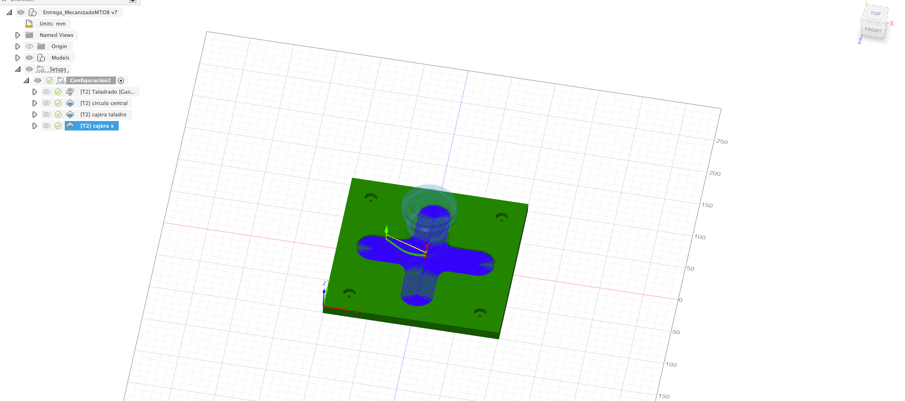

import ReactPlayer from "react-player";

# Actividad MT08

## Actividad MT08: Control Numérico Computarizado (CNC)

En este módulo, dirigido por Maximiliano Torres, experto en fabricación digital de UTEC, profundizamos en las técnicas de fabricación mediante Control Numérico Computarizado (CNC).

## Conceptos Generales

El objetivo principal de esta actividad fue generar un archivo `.gcode` adecuado para ser utilizado en un router CNC, a partir de un modelo 3D proporcionado por los instructores. Documenté cada paso del proceso, incluyendo capturas de pantalla, y preparé todo el contenido para subir a la página correspondiente de documentación del MT08. Aquí, también se puede descargar el archivo `.NC`.

### Pasos Seguidos

1. **Descarga del Modelo**: Inicié el proceso descargando el archivo `.f3d` desde la plataforma EDU.
2. **Apertura en Fusion 360**: Cargué el archivo en Fusion 360 y le aplique un estilo de madera.

3. **Configuración de la Máquina**: Establecí la configuración de la máquina utilizando como referencia la Autodesk Generic 3-axis Router disponible en la galería.

4. **Definición de Herramientas y Operaciones de Mecanizado**: Elegí la fresa adecuada, ⅛” Flat Endmill, y realicé las operaciones de mecanizado utilizando las funciones de 2D CAJERAS, TALADRADO y CONTORNEADO, con una profundidad de pasada de 1 mm.

5. **Simulación de Operaciones**: Verifiqué cada operación mediante simulación para asegurarme de que el material se mecanizara correctamente y tomara la forma deseada.

6. **Generación del Código G**: Finalmente, generé el código G en formato `.NC`, asegurándome de incluir mi nombre en el archivo, como "Nombre_Apellido.nc".

   
   
   
   
   
   
   
   
   
   
   
   
   
   

## Simulacion

<ReactPlayer controls url="/EDFI/video/MT08/final.mp4" />

## Archivos (generado y provisto por el docente.)

- [Archivo final NC](../../../img/MT08/MathiasRodriguez.nc)
- [Tool](../../../img/MT08/f360-easel.cps)

## Conclusión

Este módulo no solo reforzó mi entendimiento sobre el diseño asistido por computadora y la fabricación CNC, sino que también me permitió aplicar estos conocimientos de manera práctica. Estoy entusiasmado por continuar explorando y perfeccionando estas habilidades en futuros proyectos de fabricación digital.
