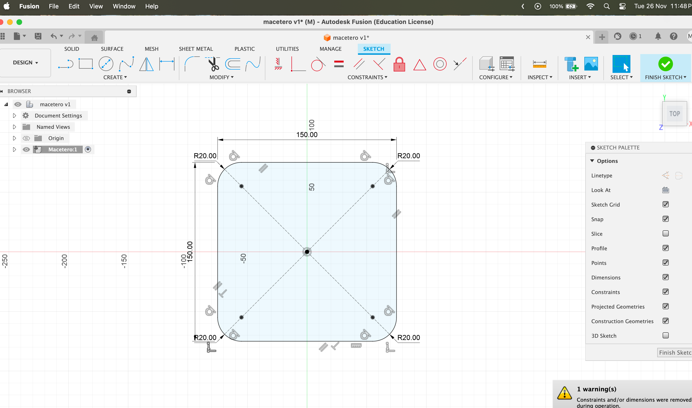

import ReactPlayer from "react-player";

# Actividad MT09

## Actividad MT09: Moldes

En el módulo MT09, mi objetivo fue diseñar y modelar una maceta utilizando el software Fusion 360. Posteriormente, trabajé en la creación de un molde para la fabricación de la maceta. Este molde podía constar de entre 1 y 4 caras, incorporando guías de encastre en caso de contar con varias piezas. Además, para garantizar un proceso de fabricación eficiente, tuve que aplicar ángulos de desmoldeo en todas las superficies del molde, facilitando así el proceso de desmoldeo.

## Proceso en imagenes.

## Conclusión

Este módulo no solo reforzó mi entendimiento sobre el diseño asistido por computadora, sino que también me permitió aplicar estos conocimientos de manera práctica. Fue muy desafiante para mi ya que el diseño es de las areas que mas me cuesta pero pude lograr la tarea planteada.
