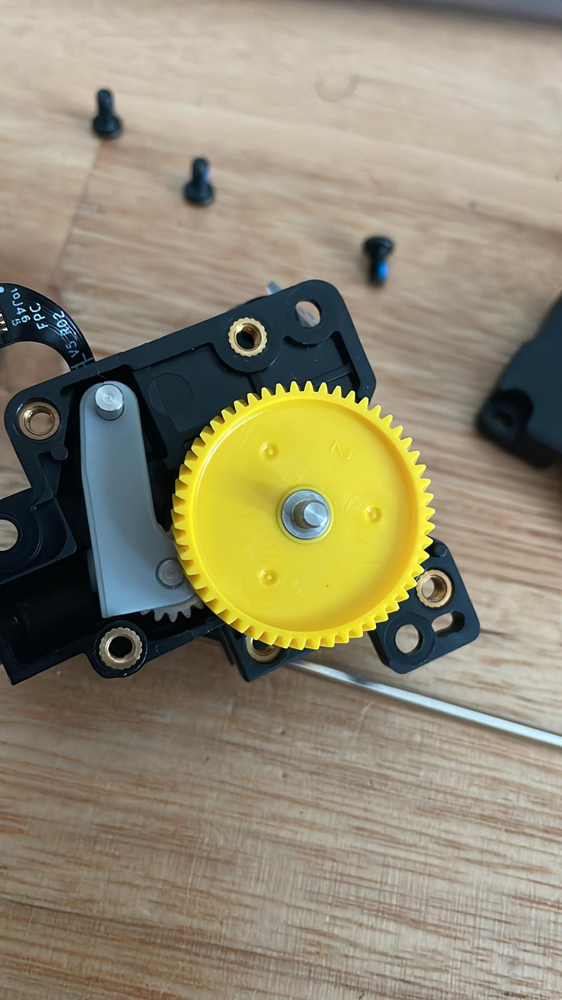
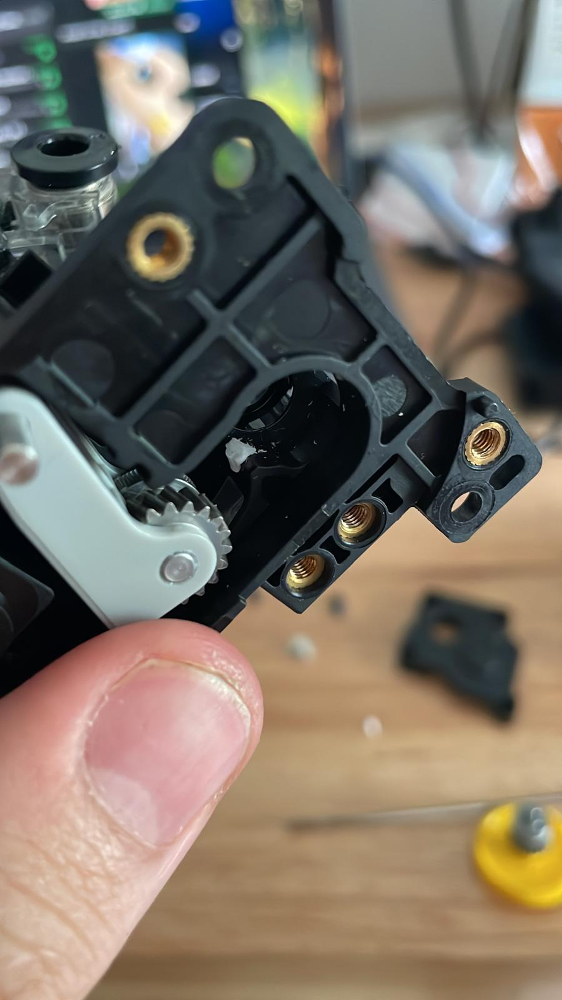
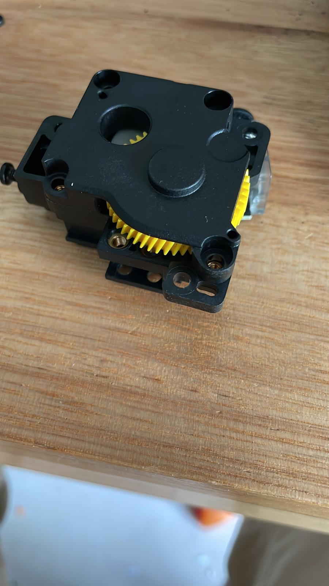
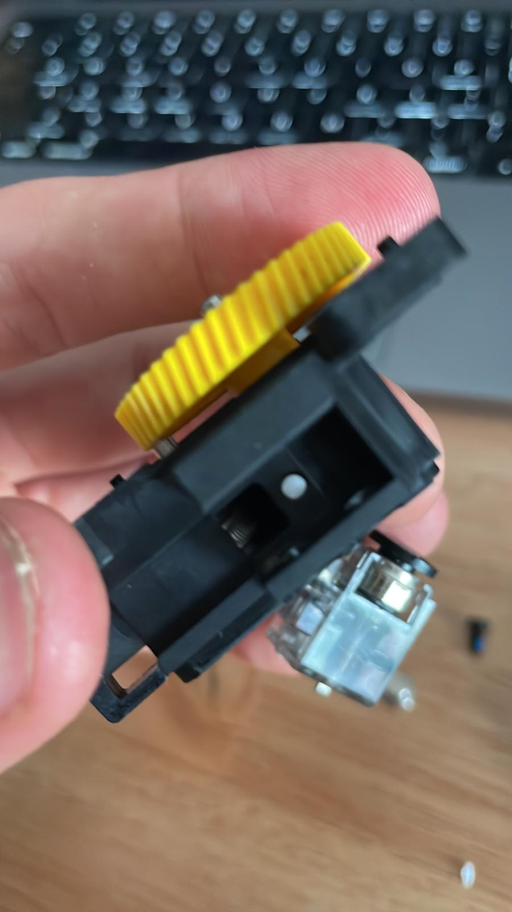
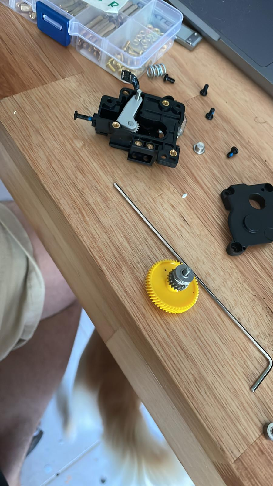

# Resultado

## Preguntas y respuestas:

* **¿Cómo puede un juego ser inclusivo para niños con discapacidades sensoriales?**
  * A través de la integración de estímulos tanto auditivos como visuales, permitiendo la participación activa de niños no videntes, sordos y sus familias.
* **¿Es posible diseñar un dispositivo accesible que involucre a todos los miembros de la familia?**
  * Sí, el juego diseñado permite la interacción simultánea de personas con diferentes capacidades sensoriales, fomentando la inclusión familiar y ofreciendo una experiencia compartida.
* **¿Qué materiales y tecnologías son adecuados para desarrollar este tipo de juego?**
  * La combinación de impresión 3D para la estructura, luces LED, parlante, microcontrolador ESP32 y pulsador fueron clave para el funcionamiento y accesibilidad del juego.

## Aspectos clave y oportunidades de mejora:

Aspectos que funcionaron correctamente: 

* **Interactividad multisensorial** : El sistema de luces LED y sonido integrado funciona correctamente, proporcionando una experiencia que involucra tanto el sentido de la vista como el oído.
* **Funcionalidad del pulsador** : El pulsador permite activar las luces y sonidos de manera efectiva, lo que facilita la interacción de los usuarios.
* **Compatibilidad de los componentes** : La integración entre los componentes electrónicos (microcontrolador, luces, parlante, etc.) fue exitosa, funcionando de manera coordinada.

**Oportunidades de mejora y ajustes realizados:**

* **Reajuste de la lógica de programación** : Fue necesario revisar y ajustar la lógica del código, especialmente en lo que respecta a la integración de las luces y el sonido. La sincronización de ambos elementos resultó ser más compleja de lo inicialmente anticipado, lo que requirió modificaciones en la programación para asegurar una respuesta adecuada y coherente entre las distintas partes del sistema.
* **Problemas con la impresora 3D** : Durante el proceso de fabricación de la estructura, surgieron dificultades técnicas con la impresora 3D, específicamente un atasco en el extrusor. Esto obligó a desarmar y volver a montar la impresora para resolver el inconveniente y reanudar la impresión. Además, el proceso de diseño del prototipo incluyó múltiples pruebas de ajuste, como la modificación de los diámetros para las luces y la revisión del modelo para optimizar la distribución de los componentes. En paralelo, se realizaron pruebas con distintos rollos de filamento, algunos de los cuales presentaron signos de haber absorbido humedad, lo que afectó la calidad de las impresiones y requirió ajustes adicionales.

