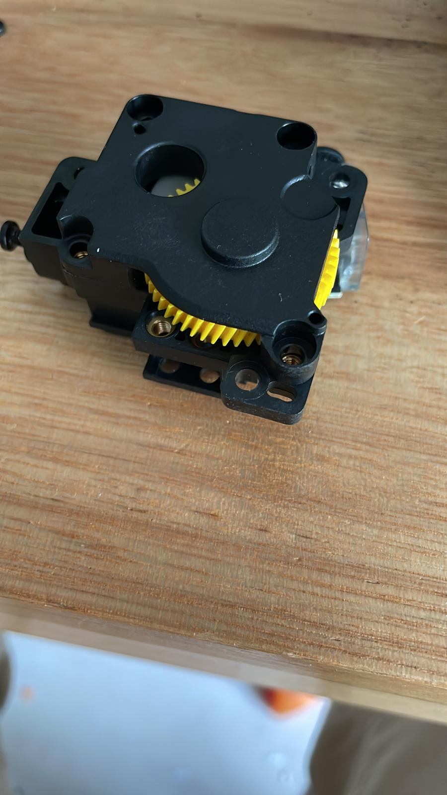
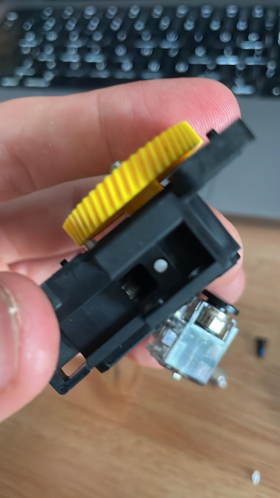
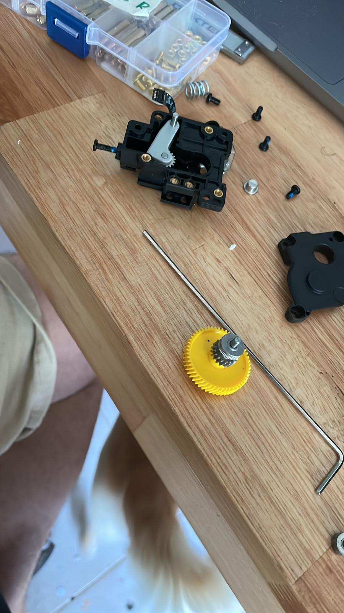

import ReactPlayer from "react-player";

# Resultado

## Preguntas y respuestas:

- **¿Cómo puede un juego ser inclusivo para niños con discapacidades sensoriales?**
  - A través de la integración de estímulos tanto auditivos como visuales, permitiendo la participación activa de niños no videntes, sordos y sus familias.
- **¿Es posible diseñar un dispositivo accesible que involucre a todos los miembros de la familia?**
  - Sí, el juego diseñado permite la interacción simultánea de personas con diferentes capacidades sensoriales, fomentando la inclusión familiar y ofreciendo una experiencia compartida.
- **¿Qué materiales y tecnologías son adecuados para desarrollar este tipo de juego?**
  - La combinación de impresión 3D para la estructura, luces LED, parlante, microcontrolador ESP32 y pulsador fueron clave para el funcionamiento y accesibilidad del juego.

## Aspectos clave y oportunidades de mejora:

Aspectos que funcionaron correctamente:

- **Interactividad multisensorial** : El sistema de luces LED y sonido integrado funciona correctamente, proporcionando una experiencia que involucra tanto el sentido de la vista como el oído.
- **Funcionalidad del pulsador** : El pulsador permite activar las luces y sonidos de manera efectiva, lo que facilita la interacción de los usuarios.
- **Compatibilidad de los componentes** : La integración entre los componentes electrónicos (microcontrolador, luces, parlante, etc.) fue exitosa, funcionando de manera coordinada.

**Oportunidades de mejora y ajustes realizados:**

- **Reajuste de la lógica de programación** : Fue necesario revisar y ajustar la lógica del código, especialmente en lo que respecta a la integración de las luces y el sonido. La sincronización de ambos elementos resultó ser más compleja de lo inicialmente anticipado, lo que requirió modificaciones en la programación para asegurar una respuesta adecuada y coherente entre las distintas partes del sistema.
- **Problemas con la impresora 3D** : Durante el proceso de fabricación de la estructura, surgieron dificultades técnicas con la impresora 3D, específicamente un atasco en el extrusor. Esto obligó a desarmar y volver a montar la impresora para resolver el inconveniente y reanudar la impresión. Además, el proceso de diseño del prototipo incluyó múltiples pruebas de ajuste, como la modificación de los diámetros para las luces y la revisión del modelo para optimizar la distribución de los componentes. En paralelo, se realizaron pruebas con distintos rollos de filamento, algunos de los cuales presentaron signos de haber absorbido humedad, lo que afectó la calidad de las impresiones y requirió ajustes adicionales.






## Código Final

```c
#include <Arduino.h>
#include <SPI.h>
#include <SD.h>
#include <Audio.h>
#include <esp_now.h>
#include <WiFi.h>
// Configuración de pines I2S
#define I2S_DOUT 27 // DIN
#define I2S_BCLK 26 // BCLK
#define I2S_LRC 25  // LRC
#define CS_SD 32    // Pin CS de la microSD

// Dirección MAC del receptor (esclavo)
uint8_t receiverAddress[6] = {0xC8, 0xF0, 0x9E, 0xA0, 0xFB, 0x24};
// Estructura de datos a enviar
typedef struct Message
{
  uint32_t sequence; // Número de secuencia
  char text[32];     // Contenido del mensaje
} Message;

Message incomingMessage;
uint32_t lastSequenceReceived = 0; // Último
Message outgoingMessage;
Audio audio;

// Enum para los tipos de reproducción
enum AudioType
{
  FRASE,
  NUMERO,
  SECUENCIA,
  NIVEL,
  READY
};

// Array de frases del 1 al 100
String frases[100] = {
    "frase1", "frase2", "frase3", "frase4", "frase5", "frase6", "frase7", "frase8", "frase9", "frase10",
    "frase11", "frase12", "frase13", "frase14", "frase15", "frase16", "frase17", "frase18", "frase19", "frase20",
    "frase21", "frase22", "frase23", "frase24", "frase25", "frase26", "frase27", "frase28", "frase29", "frase30",
    "frase31", "frase32", "frase33", "frase34", "frase35", "frase36", "frase37", "frase38", "frase39", "frase40",
    "frase41", "frase42", "frase43", "frase44", "frase45", "frase46", "frase47", "frase48", "frase49", "frase50",
    "frase51", "frase52", "frase53", "frase54", "frase55", "frase56", "frase57", "frase58", "frase59", "frase60",
    "frase61", "frase62", "frase63", "frase64", "frase65", "frase66", "frase67", "frase68", "frase69", "frase70",
    "frase71", "frase72", "frase73", "frase74", "frase75", "frase76", "frase77", "frase78", "frase79", "frase80",
    "frase81", "frase82", "frase83", "frase84", "frase85", "frase86", "frase87", "frase88", "frase89", "frase90",
    "frase91", "frase92", "frase93", "frase94", "frase95", "frase96", "frase97", "frase98", "frase99", "frase100"};

// Array para controlar qué frases ya fueron seleccionadas
bool frasesUsadas[100] = {false};
int totalUsadas = 0;
// Variable para almacenar el audio actual
String currentAudio = "";
// Prototipos
void checkButtonPress();
void onDataReceive(const uint8_t *mac, const uint8_t *incomingData, int len);
void procesarMensaje(AudioType tipo, String valor, int nivel);
void playAudio(AudioType type, const String &value, int level);
void playAudioFile(const String &filePath);
bool initializeSDCard();
void enviarMensaje(AudioType tipo, const String &valor, int nivel);
String obtenerFraseAleatoria();

void setup()
{
  Serial.begin(115200);
  // Inicializar WiFi en modo estación
  WiFi.mode(WIFI_STA);
  // Inicializar ESP-NOW
  esp_now_init();
  esp_now_register_recv_cb(onDataReceive);
  // Configurar el receptor
  esp_now_peer_info_t peerInfo = {};
  memcpy(peerInfo.peer_addr, receiverAddress, sizeof(receiverAddress));
  peerInfo.channel = 0; // Canal predeterminado
  peerInfo.encrypt = false;
  esp_now_add_peer(&peerInfo);

  // Inicialización SD
  if (!initializeSDCard())
  {
    while (1)
      delay(1000);
  }

  // Configurar pines del I2S
  audio.setPinout(I2S_BCLK, I2S_LRC, I2S_DOUT);
  audio.setVolume(100);
  randomSeed(analogRead(36));
}

void loop()
{
}

// Función para devolver una frase aleatoria sin repetición
String obtenerFraseAleatoria()
{
  if (totalUsadas >= 100)
  {
    Serial.println("Se usaron todas las frases. Reiniciando...");
    // Reiniciar el array de control
    for (int i = 0; i < 100; i++)
    {
      frasesUsadas[i] = false;
    }
    totalUsadas = 0;
  }

  int indice;
  do
  {
    indice = random(0, 100); // Generar un índice aleatorio entre 0 y 99
  } while (frasesUsadas[indice]); // Repetir si la frase ya fue usada

  frasesUsadas[indice] = true; // Marcar la frase como usada
  totalUsadas++;

  return frases[indice]; // Devolver la frase seleccionada
}

// Inicializar tarjeta SD con manejo robusto de errores
bool initializeSDCard()
{
  int retries = 5; // Intentos
  while (!SD.begin(CS_SD) && retries > 0)
  {
    retries--;
    delay(1000);
  }

  return retries > 0;
}

// Reproducir un archivo MP3 directamente
void playAudioFile(const String &filePath)
{
  if (audio.connecttoSD(filePath.c_str()))
  {
    while (audio.isRunning())
    {
      audio.loop();
      vTaskDelay(1); // Evitar bloqueo
    }
  }
}

// Procesar el audio directamente
void playAudio(AudioType type, const String &value, int level)
{
  String filePath = "";
  if (type == NUMERO)
  {
    filePath = "/audios/numeros/" + String(level) + "/" + value + ".mp3";
  }
  else if (type == SECUENCIA)
  {
    filePath = "/audios/secuencias/" + value + ".mp3";
  }
  else if (type == NIVEL)
  {
    filePath = "/audios/niveles/nivel" + value + ".mp3";
  }
  else if (type == FRASE)
  {
    String frase = obtenerFraseAleatoria();
    filePath = "/audios/frases/" + frase + ".mp3";
  }
  else if (type == READY)
  {
    enviarMensaje(READY, "READY", 0);
  }

  if (!filePath.isEmpty() && SD.exists(filePath))
  {
    playAudioFile(filePath);
  }
}

// Procesar mensaje recibido
void procesarMensaje(AudioType tipo, String valor, int nivel)
{
  playAudio(tipo, valor, nivel);
}

// Recibir y procesar mensajes directamente
void onDataReceive(const uint8_t *mac, const uint8_t *incomingData, int len)
{
  // Validar el tamaño del mensaje recibido
  if (len != sizeof(Message))
  {
    Serial.println("Error: Tamaño de mensaje no coincide con la estructura esperada.");
    return;
  }

  // Copiar los datos recibidos al struct `incomingMessage`
  Message receivedMessage;
  memcpy(&receivedMessage, incomingData, sizeof(Message));

  // Validar el orden del mensaje usando la secuencia
  if (receivedMessage.sequence > lastSequenceReceived)
  {
    lastSequenceReceived = receivedMessage.sequence; // Actualizar el último número de secuencia recibido

    Serial.printf("Mensaje recibido en orden. Secuencia: %u\n", receivedMessage.sequence);
    Serial.printf("Contenido: %s\n", receivedMessage.text);

    // Procesar el mensaje recibido en formato "[MSG]tipo-valor-nivel[END]"
    String mensajeCompleto = String(receivedMessage.text);

    // Verificar que el mensaje tiene el formato esperado
    if (mensajeCompleto.startsWith("[MSG]") && mensajeCompleto.endsWith("[END]"))
    {
      // Extraer el contenido entre "[MSG]" y "[END]"
      mensajeCompleto = mensajeCompleto.substring(5, mensajeCompleto.length() - 5);

      int index1 = mensajeCompleto.indexOf("-");
      int index2 = mensajeCompleto.lastIndexOf("-");

      if (index1 != -1 && index2 != -1 && index1 < index2)
      {
        String tipo = mensajeCompleto.substring(0, index1);
        String valor = mensajeCompleto.substring(index1 + 1, index2);
        String nivel = mensajeCompleto.substring(index2 + 1);

        // Validar y procesar el mensaje
        if (tipo.toInt() >= 0 && nivel.toInt() >= 0)
        {
          procesarMensaje(static_cast<AudioType>(tipo.toInt()), valor, nivel.toInt());
        }
        else
        {
          Serial.println("Error: Mensaje con formato incorrecto.");
        }
      }
      else
      {
        Serial.println("Error: No se encontraron delimitadores correctos en el mensaje.");
      }
    }
    else
    {

      Serial.println("Error: Mensaje fuera de formato esperado.");
    }
  }
  else
  {
    // Mensaje fuera de orden, descartarlo
    Serial.printf("Mensaje descartado (fuera de orden). Secuencia: %u\n", receivedMessage.sequence);
  }
}

void enviarMensaje(AudioType tipo, const String &valor, int nivel)
{
  Message mensaje;

  // Asignar un número de secuencia único
  static uint32_t sequenceNumber = 0;
  mensaje.sequence = ++sequenceNumber;

  // Construir el texto del mensaje
  String mensajeStr = "[MSG]" + String(tipo) + "-" + valor + "-" + String(nivel) + "[END]";
  strncpy(mensaje.text, mensajeStr.c_str(), sizeof(mensaje.text) - 1);
  mensaje.text[sizeof(mensaje.text) - 1] = '\0'; // Asegurar terminador nulo

  // Enviar el mensaje usando ESP-NOW
  esp_err_t result = esp_now_send(receiverAddress, (uint8_t *)&mensaje, sizeof(mensaje));
  if (result == ESP_OK)
  {
    Serial.printf("Mensaje enviado con éxito. Secuencia: %u\n", mensaje.sequence);
  }
  else
  {
    Serial.printf("Error al enviar mensaje. Código: %d\n", result);
  }
}
```

```c
#include <Arduino.h>
#include <Adafruit_NeoPixel.h>
#include <MD_Parola.h>
#include <MD_MAX72XX.h>
#include <SPI.h>
#include <esp_now.h>
#include <WiFi.h>
// Configuración de LEDs WS2811
#define PIN 18
#define NUMPIXELS 50
#define BUTTON_PIN 4

// Estructura de datos recibidos
typedef struct Message
{
  uint32_t sequence; // Número de secuencia
  char text[32];     // Contenido del mensaje
} Message;

Message incomingMessage;
Message outgoingMessage;
uint32_t sequenceNumber = 0;       // Número de secuencia actual para los envíos
uint32_t lastSequenceReceived = 0; // Último número de secuencia recibido

Adafruit_NeoPixel strip = Adafruit_NeoPixel(NUMPIXELS, PIN, NEO_RGB + NEO_KHZ800);

// Configuración de MAX7219
#define HARDWARE_TYPE MD_MAX72XX::FC16_HW
#define MAX_DEVICES 4
#define DATA_PIN 23
#define CLK_PIN 19
#define CS_PIN 5

MD_Parola matrizTexto = MD_Parola(HARDWARE_TYPE, DATA_PIN, CLK_PIN, CS_PIN, MAX_DEVICES);
MD_MAX72XX matrizEmojis = MD_MAX72XX(HARDWARE_TYPE, DATA_PIN, CLK_PIN, CS_PIN, MAX_DEVICES);

// Constantes de colores
const uint32_t COLOR_BLUE = Adafruit_NeoPixel::Color(0, 0, 255);
const uint32_t COLOR_GREEN = Adafruit_NeoPixel::Color(0, 255, 0);
const uint32_t COLOR_RED = Adafruit_NeoPixel::Color(255, 0, 0);
const uint32_t COLOR_YELLOW = Adafruit_NeoPixel::Color(255, 255, 0);
const uint32_t COLOR_OFF = Adafruit_NeoPixel::Color(0, 0, 0);

// Audios
int audioDurations[30][50] = {
    {862, 679, 783, 835, 914, 1018, 1018, 862, 914, 862, 783, 731, 914, 914, 731, 1097, 1201, 1018, 1149, 783, 1018, 1149, 1253, 1253, 1280, 1149, 1149, 1149, 1149, 914, 1201, 1201, 1253, 1280, 1253, 1280, 1332, 1201, 1280, 966, 1280, 1097, 1332, 1253, 1253, 1332, 1671, 1280, 1280, 966},
    {705, 574, 653, 679, 757, 835, 835, 705, 731, 705, 653, 600, 757, 757, 600, 888, 966, 809, 914, 653, 835, 914, 1018, 1018, 1018, 940, 940, 914, 940, 757, 966, 966, 1018, 1018, 1018, 1044, 1071, 966, 1018, 783, 1018, 888, 1071, 1018, 1018, 1071, 1332, 1018, 1018, 783},
    {574, 470, 522, 574, 626, 679, 679, 574, 626, 574, 548, 496, 626, 626, 496, 731, 809, 679, 757, 548, 679, 757, 809, 809, 835, 757, 757, 757, 757, 626, 809, 809, 809, 835, 835, 862, 888, 809, 835, 653, 862, 731, 888, 835, 809, 888, 1097, 835, 835, 653},
    {496, 391, 444, 496, 522, 574, 574, 496, 522, 496, 444, 417, 522, 522, 417, 626, 679, 574, 653, 444, 574, 653, 705, 705, 705, 653, 626, 653, 653, 522, 679, 679, 705, 705, 705, 705, 731, 679, 705, 548, 705, 626, 757, 705, 705, 757, 940, 705, 705, 548},
    {444, 339, 391, 444, 470, 496, 496, 444, 444, 444, 417, 365, 470, 444, 365, 522, 574, 496, 548, 391, 522, 548, 626, 600, 626, 574, 548, 548, 548, 470, 600, 600, 600, 626, 600, 626, 653, 574, 626, 496, 626, 522, 653, 600, 600, 653, 809, 626, 626, 496},
    {391, 287, 339, 365, 391, 444, 444, 391, 391, 391, 339, 313, 391, 417, 313, 470, 522, 444, 496, 339, 444, 496, 522, 522, 548, 496, 496, 496, 496, 417, 496, 522, 548, 548, 548, 548, 574, 496, 548, 417, 548, 470, 574, 548, 522, 574, 679, 548, 548, 417},
    {339, 261, 339, 313, 365, 391, 391, 365, 365, 365, 313, 313, 365, 365, 313, 417, 444, 391, 444, 339, 391, 444, 496, 496, 470, 444, 444, 444, 444, 365, 444, 444, 496, 470, 496, 496, 496, 444, 470, 391, 470, 444, 496, 496, 496, 496, 626, 496, 470, 391},
    {313, 235, 287, 287, 313, 391, 391, 313, 313, 313, 287, 287, 313, 313, 287, 391, 417, 391, 417, 287, 391, 417, 444, 444, 444, 417, 417, 417, 417, 313, 417, 417, 444, 444, 444, 444, 444, 417, 444, 339, 444, 391, 444, 444, 444, 444, 600, 444, 444, 339},
    {287, 235, 287, 261, 287, 339, 313, 287, 287, 287, 261, 261, 287, 287, 261, 365, 417, 339, 365, 261, 339, 365, 417, 417, 417, 365, 365, 365, 365, 287, 391, 391, 391, 417, 417, 417, 444, 391, 417, 339, 417, 365, 444, 417, 391, 444, 548, 417, 417, 339},
    {261, 235, 261, 235, 261, 313, 313, 287, 261, 287, 261, 235, 261, 261, 235, 313, 365, 313, 339, 261, 313, 339, 365, 365, 391, 339, 339, 339, 339, 261, 365, 365, 365, 365, 365, 391, 391, 365, 391, 313, 391, 339, 391, 365, 365, 391, 470, 391, 391, 313},
    {235, 208, 235, 261, 261, 287, 313, 235, 261, 235, 235, 208, 261, 261, 208, 313, 339, 261, 313, 235, 287, 313, 339, 339, 365, 313, 313, 313, 313, 261, 313, 339, 339, 339, 339, 339, 365, 339, 339, 261, 339, 313, 365, 339, 339, 365, 470, 339, 339, 261},
    {235, 182, 208, 235, 261, 287, 261, 235, 261, 235, 208, 208, 261, 261, 208, 313, 339, 287, 287, 208, 287, 287, 313, 313, 339, 287, 287, 287, 287, 235, 339, 339, 313, 313, 313, 313, 339, 313, 339, 235, 339, 287, 339, 313, 313, 339, 417, 339, 339, 235},
    {235, 182, 208, 208, 235, 235, 235, 235, 235, 235, 208, 182, 235, 235, 182, 261, 287, 235, 287, 208, 235, 261, 287, 313, 313, 261, 261, 261, 261, 235, 287, 313, 287, 313, 287, 313, 313, 287, 313, 261, 313, 261, 313, 287, 287, 313, 391, 313, 313, 261},
    {208, 182, 208, 208, 235, 235, 235, 208, 235, 208, 182, 182, 235, 235, 182, 235, 261, 235, 287, 182, 261, 287, 313, 313, 313, 287, 287, 287, 287, 235, 261, 261, 287, 313, 287, 287, 287, 261, 287, 235, 287, 235, 287, 287, 287, 287, 365, 287, 287, 235},
    {208, 156, 182, 182, 208, 235, 235, 235, 208, 208, 182, 182, 208, 208, 182, 261, 287, 235, 235, 182, 235, 235, 261, 261, 261, 235, 235, 235, 235, 208, 261, 261, 261, 261, 261, 261, 313, 261, 261, 235, 261, 261, 287, 261, 261, 313, 339, 261, 261, 235},
    {182, 156, 208, 182, 208, 235, 235, 182, 208, 182, 182, 156, 208, 208, 156, 235, 235, 235, 261, 208, 235, 261, 235, 235, 287, 261, 261, 261, 261, 208, 235, 235, 235, 287, 235, 287, 261, 235, 287, 208, 287, 235, 261, 261, 235, 261, 365, 287, 287, 208},
    {182, 156, 156, 182, 182, 208, 208, 182, 182, 182, 156, 156, 182, 182, 156, 235, 235, 208, 235, 156, 208, 235, 235, 235, 235, 235, 235, 235, 235, 182, 235, 235, 235, 235, 235, 235, 261, 261, 235, 208, 235, 235, 261, 235, 235, 261, 313, 235, 235, 208},
    {182, 130, 156, 156, 182, 208, 208, 182, 182, 182, 156, 156, 182, 182, 182, 208, 235, 208, 235, 156, 208, 235, 235, 235, 261, 235, 235, 235, 235, 182, 235, 235, 235, 261, 235, 235, 235, 235, 261, 182, 261, 208, 235, 235, 235, 235, 287, 261, 261, 182},
    {156, 130, 156, 156, 182, 182, 182, 156, 208, 156, 156, 130, 182, 182, 156, 208, 235, 182, 208, 156, 182, 208, 235, 235, 235, 208, 208, 208, 208, 182, 235, 235, 235, 235, 235, 235, 261, 235, 235, 182, 235, 208, 261, 235, 235, 261, 287, 235, 235, 182},
    {156, 130, 156, 156, 156, 182, 182, 156, 156, 156, 156, 130, 156, 156, 130, 208, 208, 182, 208, 156, 182, 208, 235, 235, 235, 208, 208, 208, 208, 156, 208, 208, 235, 235, 235, 235, 235, 208, 235, 182, 235, 208, 235, 235, 235, 235, 261, 235, 235, 182},
    {156, 130, 130, 156, 156, 182, 182, 156, 156, 156, 130, 130, 156, 156, 130, 182, 208, 182, 235, 130, 182, 208, 208, 208, 208, 208, 208, 208, 208, 156, 208, 208, 208, 208, 208, 208, 235, 208, 208, 182, 208, 182, 235, 208, 208, 235, 261, 208, 208, 156},
    {156, 130, 130, 156, 156, 182, 208, 182, 156, 156, 130, 130, 156, 156, 130, 182, 208, 182, 182, 130, 182, 182, 208, 208, 208, 182, 182, 182, 182, 156, 235, 208, 208, 208, 208, 208, 208, 208, 208, 156, 208, 182, 208, 208, 208, 208, 261, 208, 208, 156},
    {130, 104, 130, 130, 156, 156, 156, 130, 156, 130, 130, 130, 156, 156, 130, 182, 182, 156, 182, 130, 156, 182, 208, 235, 208, 182, 182, 182, 182, 156, 182, 182, 235, 208, 235, 208, 208, 182, 208, 156, 208, 182, 208, 208, 208, 208, 235, 208, 208, 156},
    {130, 104, 130, 130, 156, 156, 156, 130, 156, 130, 130, 130, 156, 156, 130, 156, 182, 156, 182, 130, 156, 182, 182, 182, 182, 182, 182, 182, 182, 156, 182, 182, 182, 208, 182, 208, 208, 182, 182, 156, 208, 182, 208, 182, 182, 208, 235, 182, 208, 156},
    {130, 104, 130, 130, 130, 156, 156, 130, 130, 130, 156, 104, 130, 130, 104, 156, 182, 156, 182, 130, 156, 182, 182, 182, 182, 182, 182, 182, 182, 130, 182, 182, 182, 182, 182, 182, 208, 182, 182, 156, 182, 156, 208, 182, 182, 208, 235, 182, 182, 182},
    {130, 104, 130, 130, 130, 156, 182, 130, 130, 130, 130, 104, 130, 130, 104, 156, 182, 156, 156, 130, 156, 156, 182, 182, 182, 156, 156, 156, 156, 130, 182, 182, 182, 182, 182, 182, 182, 208, 182, 156, 182, 156, 182, 182, 182, 182, 235, 182, 182, 130},
    {130, 104, 104, 156, 130, 156, 156, 130, 130, 130, 104, 104, 130, 130, 104, 156, 156, 156, 156, 104, 156, 156, 182, 182, 182, 156, 156, 156, 156, 130, 156, 156, 182, 182, 182, 182, 182, 156, 182, 130, 182, 156, 182, 208, 182, 182, 235, 182, 182, 130},
    {156, 104, 104, 104, 130, 130, 130, 156, 130, 156, 104, 104, 130, 130, 104, 156, 156, 130, 156, 104, 130, 156, 156, 156, 208, 156, 156, 156, 156, 130, 156, 156, 156, 208, 182, 182, 182, 156, 182, 130, 208, 156, 182, 156, 156, 182, 208, 182, 182, 130},
    {130, 130, 104, 104, 130, 130, 130, 130, 130, 130, 104, 104, 130, 130, 104, 156, 156, 130, 156, 104, 130, 156, 156, 156, 156, 156, 156, 156, 156, 130, 156, 156, 156, 156, 156, 156, 182, 156, 156, 130, 156, 156, 182, 156, 156, 182, 208, 156, 156, 130},
    {104, 104, 104, 104, 130, 130, 130, 104, 130, 104, 104, 104, 156, 156, 104, 130, 156, 130, 156, 104, 130, 156, 156, 156, 156, 156, 156, 156, 156, 130, 156, 156, 156, 156, 156, 156, 156, 156, 156, 130, 156, 130, 156, 156, 156, 156, 208, 156, 156, 130}};

// Emojis
uint8_t sonrisa[8] = {
    B00111100,
    B01000010,
    B10100101,
    B10000001,
    B10100101,
    B10011001,
    B01000010,
    B00111100};

uint8_t triste[8] = {
    B00111100,
    B01000010,
    B10100101,
    B10000001,
    B10000001,
    B10111101,
    B01000010,
    B00111100};

uint8_t flecha_arriba[8] = {
    B00011000,
    B00111100,
    B01111110,
    B11111111,
    B00011000,
    B00011000,
    B00011000,
    B00000000};

// Variables del juego
int currentIndex = 0;                // Índice del LED activo
int speedDelay = 300;                // Velocidad inicial del juego
int animationDelay = 300;            // Velocidad inicial de la animación de la pelota
int testigoIndex = 49;               // Índice del LED testigo
volatile bool buttonPressed = false; // Flag para el botón
bool gamePaused = true;              // Pausa el juego mientras muestra mensajes
int currentLevel = 1;
bool showBall = false;
bool readyToStart = false; // Flag de sincronización
// Variables de rebote horizontal y diagonal
struct Ball
{
  int x;                   // Posición X (columna superior izquierda del cuadrado)
  int y;                   // Posición Y (fila superior izquierda del cuadrado)
  int dx;                  // Dirección X
  int dy;                  // Dirección Y
  int size;                // Tamaño de la pelota (3x3 en este caso)
} ball = {10, 2, 1, 1, 3}; // Pelota cuadrada de tamaño 3x3

uint8_t masterAddress[6] = {0x78, 0x21, 0x84, 0xB8, 0xFF, 0x4C};

enum AudioType
{
  FRASE,
  NUMERO,
  SECUENCIA,
  NIVEL,
  READY
};

// Funciones adelantadas
void flashAllLEDsAndEmoji(uint32_t color, uint8_t *emoji, int times);
void checkButtonPress();
void updateLEDs();
void mostrarTexto(const char *texto, int duration);
void mostrarEmoji(uint8_t *emoji, int duration);
void mostrarPelotaRebotando();
void resetGame(bool resetLevel);
void enviarMensaje(AudioType tipo, String valor, int nivel);
void onDataReceive(const uint8_t *mac, const uint8_t *incomingData, int len);

void onDataReceive(const uint8_t *mac, const uint8_t *incomingData, int len)
{
  Message receivedMessage;
  memcpy(&receivedMessage, incomingData, sizeof(Message));

  String mensajeCompleto = String(receivedMessage.text);
  if (mensajeCompleto == "[MSG]4-READY-0[END]" || (strcmp(incomingMessage.text, "[MSG]2-READY-0[END]") == 0))
  {
    readyToStart = true;
  }
}

// Configuración inicial
void setup()
{
  Serial.begin(115200);
  // Inicializar WiFi en modo estación
  WiFi.mode(WIFI_STA);
  esp_now_init();

  // Registrar el callback para recibir datos
  esp_now_register_recv_cb(onDataReceive);

  // Configurar el maestro como peer
  esp_now_peer_info_t peerInfo = {};
  memcpy(peerInfo.peer_addr, masterAddress, sizeof(masterAddress));
  peerInfo.channel = 0;     // Canal predeterminado
  peerInfo.encrypt = false; // Sin encriptación

  esp_now_add_peer(&peerInfo);

  strip.begin();
  strip.clear();
  strip.show();
  strip.setPixelColor(testigoIndex, COLOR_YELLOW);
  pinMode(BUTTON_PIN, INPUT_PULLUP);

  attachInterrupt(digitalPinToInterrupt(BUTTON_PIN), []()
                  { if (!gamePaused) buttonPressed = true; }, FALLING);

  matrizTexto.begin();
  matrizTexto.setIntensity(5);

  matrizEmojis.begin();
  matrizEmojis.control(MD_MAX72XX::INTENSITY, 5);
  while (!readyToStart)
  {
    delay(100);
    enviarMensaje(READY, "READY", 0);
    mostrarTexto("Iniciando", 2000);
  }
  // Mostrar mensaje de bienvenida
  enviarMensaje(SECUENCIA, "bienvenidos", 0);
  mostrarTexto("Bienvenidos", 2000);
  enviarMensaje(NIVEL, "1", 0);
  mostrarTexto("Nivel 1", 1000);

  strip.setPixelColor(testigoIndex, COLOR_YELLOW);
  strip.show();
  gamePaused = false; // Iniciar el juego después de mostrar el mensaje inicial
  mostrarEmoji(sonrisa, 500);
  showBall = true;
}

void loop()
{
  if (!gamePaused)
  {
    if (buttonPressed)
    {
      checkButtonPress();
      buttonPressed = false;
    }

    updateLEDs();
    if (showBall)
    {
      mostrarPelotaRebotando();
    }
    delay(speedDelay);
  }
}

void enviarMensaje(AudioType tipo, String valor, int nivel)
{
  Message mensaje;

  // Incrementar y asignar el número de secuencia
  mensaje.sequence = ++sequenceNumber;

  // Construir el texto del mensaje
  String mensajeStr = "[MSG]" + String(tipo) + "-" + valor + "-" + String(nivel) + "[END]";
  strncpy(mensaje.text, mensajeStr.c_str(), sizeof(mensaje.text) - 1);
  mensaje.text[sizeof(mensaje.text) - 1] = '\0';

  // Enviar el mensaje usando ESP-NOW
  esp_err_t result = esp_now_send(masterAddress, (uint8_t *)&mensaje, sizeof(mensaje));
}
void checkButtonPress()
{
  int adjustedIndex = (currentIndex == 0) ? NUMPIXELS : currentIndex;

  if (adjustedIndex == testigoIndex + 1)
  {
    enviarMensaje(SECUENCIA, "ganaste", 0);
    enviarMensaje(FRASE, "0", 0);
    flashAllLEDsAndEmoji(COLOR_GREEN, sonrisa, 3); // Verde con carita feliz
    mostrarTexto("Ganaste", 500);
    currentLevel++;
    String nivelMsg = "Nivel " + String(currentLevel);
    enviarMensaje(NIVEL, String(currentLevel), 0);
    mostrarTexto(nivelMsg.c_str(), 500);
    mostrarEmoji(flecha_arriba, 500);

    resetGame(false);

    // Incremento agresivo de velocidad con cada nivel
    speedDelay = max(20, speedDelay - (50 + currentLevel * 5));         // Reducción más notable
    animationDelay = max(20, animationDelay - (50 + currentLevel * 5)); // Reducción más notable
  }
  else
  {
    enviarMensaje(SECUENCIA, "perdiste", 0);
    flashAllLEDsAndEmoji(COLOR_RED, triste, 3); // Rojo con carita triste
    mostrarTexto("Perdiste", 500);
    enviarMensaje(NIVEL, "1", 0);
    mostrarTexto("Nivel 1", 500);

    resetGame(true); // Resetear nivel al perder
    speedDelay = 300;
    animationDelay = 300;
  }
}

void updateLEDs()
{
  // Apagar todos los LEDs
  strip.clear();
  // Encender el LED actual
  strip.setPixelColor(currentIndex, COLOR_BLUE);

  // Mostrar el LED testigo
  if (currentIndex == testigoIndex)
    strip.setPixelColor(testigoIndex, COLOR_BLUE);
  else
    strip.setPixelColor(testigoIndex, COLOR_YELLOW);

  // Actualizar la tira LED
  strip.show();

  // Enviar mensaje con el número del LED actual y nivel
  enviarMensaje(NUMERO, String(currentIndex + 1), currentLevel);

  // Esperar el tiempo definido en la matriz audioDurations
  int delayDuration = audioDurations[currentLevel - 1][currentIndex];
  delay(delayDuration);
  // Avanzar al siguiente LED
  currentIndex = (currentIndex + 1) % NUMPIXELS;
}

void flashAllLEDsAndEmoji(uint32_t color, uint8_t *emoji, int times)
{
  for (int t = 0; t < times; t++)
  {
    matrizEmojis.clear();
    for (uint8_t fila = 0; fila < 8; fila++)
    {
      matrizEmojis.setRow(1, fila, emoji[fila]);
    }
    matrizEmojis.update();

    strip.fill(color, 0, strip.numPixels());
    strip.show();
    delay(500);

    strip.clear();
    strip.show();
    delay(500);
  }

  strip.setPixelColor(testigoIndex, COLOR_YELLOW);
  strip.show();
}

void mostrarTexto(const char *texto, int duration)
{
  gamePaused = true;
  matrizTexto.displayText(texto, PA_CENTER, 50, duration, PA_SCROLL_LEFT, PA_SCROLL_LEFT);
  while (!matrizTexto.displayAnimate())
    ; // Esperar a que termine la animación
}

void mostrarEmoji(uint8_t *emoji, int duration)
{
  matrizEmojis.clear();
  for (uint8_t fila = 0; fila < 8; fila++)
  {
    matrizEmojis.setRow(1, fila, emoji[fila]);
  }
  matrizEmojis.update();
  delay(duration);
}

void mostrarPelotaRebotando()
{
  matrizEmojis.clear();
  for (int i = 0; i < ball.size; i++)
  {
    for (int j = 0; j < ball.size; j++)
    {
      int col = ball.x + j;
      int row = ball.y + i;

      if (row >= 0 && row < 8 && col >= 0 && col < MAX_DEVICES * 8)
      {
        uint8_t bitMask = (1 << row);
        matrizEmojis.setColumn(col, matrizEmojis.getColumn(col) | bitMask);
      }
    }
  }

  if (ball.x <= 0 || ball.x + ball.size >= MAX_DEVICES * 8)
    ball.dx = -ball.dx;

  if (ball.y <= 0 || ball.y + ball.size >= 8)
    ball.dy = -ball.dy;

  ball.x += ball.dx;
  ball.y += ball.dy;

  matrizEmojis.update();
  delay(animationDelay);
}

void resetGame(bool resetLevel)
{
  currentIndex = 0;
  strip.setPixelColor(testigoIndex, COLOR_YELLOW);
  strip.show();

  if (resetLevel)
    currentLevel = 1;

  gamePaused = false;
}

```


<ReactPlayer playing controls url="/EDFI/video/PROYECTO/final1.mp4" />
<ReactPlayer playing controls url="/EDFI/video/PROYECTO/final2.mp4" />
